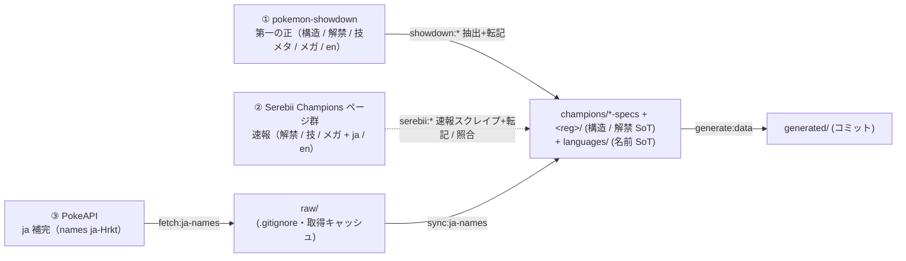

# data/ — データディレクトリ索引

`data/` 配下に何が置かれ、各ファイル / ディレクトリが**何を表すか・取得元・SoT・どの skill / コマンドで取得・更新するか**の入口（索引）。

これは**ポインタ式の索引**であり、スキーマ定義・「なぜそうか」の詳細は持たない。実体（SoT）は
[`.claude/rules/data-pipeline.md`](../.claude/rules/data-pipeline.md) ほかの rule・[`docs/design/`](../docs/design/README.md)（設計俯瞰）・
[`docs/adr/`](../docs/adr/) にあり、本 README はそこへ誘導する。詳細はリンク先を参照（このファイルには重複させない）。

## データの流れ

3 経路の取得元（① pokemon-showdown = 第一の正 / ② Serebii = 速報 / ③ PokeAPI = ja 補完）が、**showdown / Serebii の辺**
（① `showdown:*` / ② `serebii:*`）と **PokeAPI ja の辺**（③ `fetch:ja-names` → raw → `sync:ja-names`）で
**specs / languages / per-reg (SoT) に合流**し、`generate:data` が specs / languages / per-reg を変換・合成して
`generated/` を出力する（3 軸直交・ADR 0035 / 0036、権威序列・ADR 0039 / 0040）。

- `raw/` は `sync:ja-names`（PokeAPI ja）/ `scrape-serebii.ts`（Serebii 速報）の**取得キャッシュ**（`.gitignore`・`generate` は読まない）。showdown 抽出は CI 上の showdown ツリーで完結し raw を残さない。
- 構造データ（種族値 / タイプ / 特性 / 図鑑番号 / 持ち物 category）の **SoT は specs YAML**、名前（ja/en）の **SoT は languages YAML**、解禁の **SoT は per-reg YAML**。構造 / 解禁 / 技メタ / en の正は **① pokemon-showdown**、ja の正は **③ PokeAPI**、速報は **② Serebii**。
- **取得元の役割・権威序列（① 第一の正 showdown / ② 速報 Serebii / ③ ja 補完 PokeAPI）の SoT** は [`data-pipeline.md`](../.claude/rules/data-pipeline.md) の「取得元の権威序列」節。showdown PR の Serebii 照合手順は [`verify-showdown-pr`](../.claude/skills/verify-showdown-pr/SKILL.md)。本 README はそこへ誘導する索引（重複させない）。
- **責務分離**: PokeAPI ja の `raw/` の存在担保は [`update-catalog`](../.claude/skills/update-catalog/SKILL.md) **skill の責務**（手順で `fetch:ja-names` → `sync:ja-names` の順を保証）。`materialize`（sync:ja-names）/ `generate` などスクリプトは前提が揃っている前提で動き、欠けたら **fail-fast**（責務の二重化を避ける）。
- 詳細は [`data-pipeline.md`](../.claude/rules/data-pipeline.md) / [ADR 0039](../docs/adr/0039-showdown-authoritative-pokeapi-ja-only.md)（showdown 第一の正・PokeAPI ja 専任・構造取得廃止 / vendor 運用は不変）/ [ADR 0040](../docs/adr/0040-serebii-provisional-scraper-rebuild.md)（Serebii 速報降格・スクレイパー刷新）/ [ADR 0035](../docs/adr/0035-specs-languages-layout-redesign.md)（specs / languages / per-reg の 3 軸直交・名前 SoT を languages へ）/ [ADR 0036](../docs/adr/0036-mega-independent-spec-entity.md)（メガ独立 spec）。

## 索引

凡例: **取得元** = 値の一次情報源 / **SoT** = `generate` の入力（正本）/ **責務** = 取得・更新に使う skill・コマンド。
生成物（`generated/**`）は**手書き編集しない**——specs / languages / per-reg（skill 著述）を skill/AI 経由で直して再生成する。

### `raw/` — 取得キャッシュ（`.gitignore`）

| パス | 何を表すか | 取得元 | SoT | 取得・更新（責務） | スキーマ詳細 |
|---|---|---|---|---|---|
| `raw/{pokemon,pokemon-species,move,item}/*.json` | PokeAPI レスポンスの取得キャッシュ。`sync:ja-names`（materialize）の ja 転記元。`generate` は読まない | PokeAPI（ja） | —（キャッシュ・非コミット） | `fetch:ja-names`（生成）。存在担保は [`update-catalog`](../.claude/skills/update-catalog/SKILL.md) skill の責務 | [data-pipeline.md（vendor）](../.claude/rules/data-pipeline.md) |
| `raw/serebii/*.html` | Serebii 速報スクレイプの取得キャッシュ（latin-1）。`serebii:*` の転記元。`generate` は読まない | Serebii（速報） | —（キャッシュ・非コミット） | `scrape-serebii.ts`（`serebii:*` が spawn・生成） | [data-pipeline.md](../.claude/rules/data-pipeline.md) / [ADR 0040](../docs/adr/0040-serebii-provisional-scraper-rebuild.md) |

### `champions/` — 構造 specs + per-reg・skill 著述（人間直編集 NG・コミット）

| パス | 何を表すか | 取得元 | SoT | 取得・更新（責務） | スキーマ詳細 |
|---|---|---|---|---|---|
| `champions/rules.yaml` | 能力ポイント（合計66 / 各≤32）・実数値計算式の定数 | skill-authored | このファイル | AI 直接指示（対応 skill 無し・ADR 0030） | [game-spec.md](../.claude/rules/game-spec.md) |
| `champions/species-specs.yaml` | 種族 `id` + 構造データ（`dex` / `types` / `baseStats`(hp/attack/defense/spAttack/spDefense/speed) / `abilities` + `megaEvolvesTo?`・**name 無し**） | 構造=showdown（正）/ Serebii（速報） | specs | `showdown:species`（抽出+転記）/ `serebii:species`（速報） | [data-pipeline.md](../.claude/rules/data-pipeline.md) / [type-conventions.md](../.claude/rules/type-conventions.md) |
| `champions/mega-specs.yaml` | メガ `id` + `dex` / `types` / `baseStats` / `ability` + **`baseSpecies` 逆参照**（独立 spec・name 無し） | 構造=showdown（正）/ Serebii（速報） | specs | `showdown:mega` / `serebii:mega`（速報） | [data-pipeline.md](../.claude/rules/data-pipeline.md) / [ADR 0036](../docs/adr/0036-mega-independent-spec-entity.md) |
| `champions/move-specs.yaml` | per-game 技メタ `id → { type / damageClass / power / accuracy / pp / priority }`（m-a/m-b 横断・Champions 固有値・**PP は calculatePP 適用済み**・name 無し） | showdown（正・calculatePP）/ Serebii（速報） | specs（per-game） | `showdown:moves` / `serebii:moves`（速報） | [data-pipeline.md](../.claude/rules/data-pipeline.md) / [ADR 0039](../docs/adr/0039-showdown-authoritative-pokeapi-ja-only.md) |
| `champions/item-specs.yaml` | 持ち物 `id` + `category` + `megaStoneFor?` / `megaSpecies?`（name 無し） | showdown（正）/ Serebii（速報） | specs | `showdown:items` / `serebii:items`（速報） | [data-pipeline.md](../.claude/rules/data-pipeline.md) |
| `champions/ability-specs.yaml` | 特性 `id`（id のみ・name 無し） | showdown（正）/ Serebii（速報） | specs | `showdown:abilities` / `serebii:abilities`（速報） | [data-pipeline.md](../.claude/rules/data-pipeline.md) |
| `champions/type-specs.yaml` | 18 タイプ `id` + 相性倍率 `damageTo`（非 1.0 のみ・name 無し） | skill 著述（typechart 由来・任意） | specs | skill/AI 経由 | [data-pipeline.md](../.claude/rules/data-pipeline.md) / [ADR 0025](../docs/adr/archive/0025-catalog-name-and-type-chart-sot.md) |
| `champions/<reg>/{index,species,items,mega,species-moves}.yaml` | 1 レギュ = 1 ディレクトリ（`m-a/` 等）。`index`（`name`/`period`）・`species`（解禁種族 id 配列）・`items`（解禁持ち物 id 配列）・`species-moves`（種族ごと `moves` 全量）・`mega`（種族ごと解禁メガ id 配列）・block 記法 | showdown（正・mod フィルタ / learnset）/ Serebii（速報） | per-reg（解禁の正本・per-reg 一本化） | `showdown:species/items/mega`（正）/ `serebii:*`（速報）→ `check:regulation` で参照整合・schema 検証 | [data-pipeline.md](../.claude/rules/data-pipeline.md) / [ADR 0021](../docs/adr/0021-per-regulation-species-and-legality.md) / [ADR 0022](../docs/adr/0022-per-regulation-species-keyed-moves.md) |

### `languages/` — 名前 SoT・ゲーム非依存・skill 著述（人間直編集 NG・コミット）

| パス | 何を表すか | 取得元 | SoT | 取得・更新（責務） | スキーマ詳細 |
|---|---|---|---|---|---|
| `languages/{species,mega,items,moves,abilities,types}.yaml` | 各エンティティの名前 `id → { ja, en }`（ゲーム非依存・名前の SoT・ADR 0035） | en=showdown `.name`（正）/ Serebii（速報）・ja=PokeAPI `names`（正）/ Serebii（速報） | languages | en: `showdown:*` / ja: `sync:ja-names`（[`update-catalog`](../.claude/skills/update-catalog/SKILL.md)）/ 速報: `serebii:*` | [data-pipeline.md](../.claude/rules/data-pipeline.md) / [ADR 0035](../docs/adr/0035-specs-languages-layout-redesign.md) |

### `generated/` — 生成物（コミット・手書き編集禁止）

`generate:data` が specs / languages / per-reg YAML を変換・合成して出力（**raw 非依存・決定論的**・[ADR 0027](../docs/adr/archive/0027-structural-data-catalog-sot.md) / [ADR 0035](../docs/adr/0035-specs-languages-layout-redesign.md)）。値から型を派生（`type XxxDex = typeof xxxDex` / `XxxId = keyof XxxDex`）。

| パス | 何を表すか | 取得元 | SoT | 取得・更新（責務） | スキーマ詳細 |
|---|---|---|---|---|---|
| `generated/champions/species-specs.ts` | `speciesSpecsDex`（構造・dex / types / baseStats / abilities / megaEvolvesTo?・name 無し） | specs（派生） | `species-specs.yaml` | `generate:data` で再生成 | [data-pipeline.md](../.claude/rules/data-pipeline.md) / [type-conventions.md](../.claude/rules/type-conventions.md) |
| `generated/champions/mega-specs.ts` | `megaSpecsDex`（メガ構造・dex / types / baseStats / ability / baseSpecies・name 無し） | specs（派生） | `mega-specs.yaml` | `generate:data` で再生成 | [data-pipeline.md](../.claude/rules/data-pipeline.md) / [ADR 0036](../docs/adr/0036-mega-independent-spec-entity.md) |
| `generated/champions/type-specs.ts` | `typeSpecsDex`（タイプ相性・`damageTo`・1.0 補完・name 無し） | specs（派生） | `type-specs.yaml` | `generate:data` で再生成 | [data-pipeline.md](../.claude/rules/data-pipeline.md) |
| `generated/champions/move-specs.ts` | `moveSpecsDex`（per-game 技メタ・type / damageClass / power / accuracy / pp / priority・name 無し） | specs（派生） | `move-specs.yaml` | `generate:data` で再生成 | [data-pipeline.md](../.claude/rules/data-pipeline.md) / [ADR 0034](../docs/adr/archive/0034-move-meta-per-game-sot.md) |
| `generated/champions/ability-specs.ts` | `abilitySpecsDex`（**id のみ**・name 無し） | specs（派生） | `ability-specs.yaml` | `generate:data` で再生成 | [data-pipeline.md](../.claude/rules/data-pipeline.md) |
| `generated/champions/item-specs.ts` | `itemSpecsDex`（`category?` + `megaStoneFor?`・name 無し） | specs（派生） | `item-specs.yaml` | `generate:data` で再生成 | [data-pipeline.md](../.claude/rules/data-pipeline.md) |
| `generated/languages/{species,mega,items,moves,abilities,types}.ts` | 名前 dex（`speciesNames` 等・`id → { id, name: { ja, en } }`・`NameEntry`）。`index.ts` が forward マップ再 export + `speciesNamesAll`。**逆引きは consumer が実行時導出** | languages（派生） | `languages/*.yaml` | `generate:data` で再生成 | [type-conventions.md](../.claude/rules/type-conventions.md) / [cli-and-io.md](../.claude/rules/cli-and-io.md) / [ADR 0035](../docs/adr/0035-specs-languages-layout-redesign.md) |
| `generated/champions/<reg>/` | 1 レギュ = 1 ディレクトリ。`index.ts` が specs + per-reg を合成した per-reg 種族 dex `speciesDex`（per-species `moves`＝legality の型正本）+ レギュメタ。`champions/index.ts` が `regulationDex` に集約 | specs + per-reg（派生・合成） | `champions/<reg>/*.yaml` | `generate:data` で再生成 | [data-pipeline.md](../.claude/rules/data-pipeline.md) / [ADR 0021](../docs/adr/0021-per-regulation-species-and-legality.md) |

## 更新導線（どのディレクトリを直すとき何を使うか）

- **レギュレーション解禁データ（種族 / 全技 / 持ち物 / メガ）を投入・更新**: pokemon-showdown 経路（正）が `showdown-sync.yml`（GitHub Actions・`workflow_dispatch`）で `showdown:*`（抽出 + 転記）→ `check:regulation` → `generate:data` → 自動 PR（`data:authoritative`）。その PR を [`verify-showdown-pr`](../.claude/skills/verify-showdown-pr/SKILL.md) で Serebii 照合する。速報は `serebii-bulletin.yml`（`serebii:*`・`data:provisional`）。
- **育成済み個体 YAML を作成・検証**: [`author-individual`](../.claude/skills/author-individual/SKILL.md)（per-reg 種族 dex の許容値に絞り `check:individual` で検証。個体は `data/champions/` ではなく利用者の team 配下）。
- **日本語名 ja を補完する**: [`update-catalog`](../.claude/skills/update-catalog/SKILL.md)（`fetch:ja-names`（raw 取得）→ `sync:ja-names`（raw → languages の ja 転記・**append/既存尊重**で既存値を上書きしない）→ `generate:data`）。
- **生成物を作り直す**: `generate:data`（specs / languages / per-reg を変換・合成・raw 不在でも動く）。
- **検証ゲート**: `pnpm verify`（型 / カバレッジ100% / Biome / **`check:yaml-style`**）。解禁データの参照整合・schema は `check:regulation`。
- **YAML スタイル**: `data/` 配下の YAML は**全 block スタイル**（flow `[ a, b ]` / `{ k: v }` 禁止）。`check:yaml-style`（`pnpm pokeform check:yaml-style data`）が flow 混入を AST ベースで検出して非0終了する（local `.githooks/pre-commit` + CI `pnpm verify` で強制）。詳細は [data-pipeline.md](../.claude/rules/data-pipeline.md)。

> 運用ルール（`raw/` の gitignore 方針・生成物の手書き編集禁止・取得元 / SoT / 転記の対応表）の SoT は
> [`data-pipeline.md`](../.claude/rules/data-pipeline.md) にある。本 README はその索引であり、方針の実体は持たない
> （取得元方針が見直されても rule を直せば本 README のリンク先で吸収される）。
