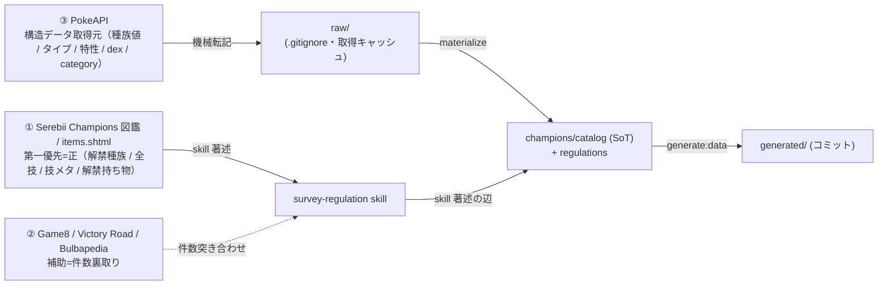

# data/ — データディレクトリ索引

`data/` 配下に何が置かれ、各ファイル / ディレクトリが**何を表すか・取得元・SoT・どの skill / コマンドで取得・更新するか**の入口（索引）。

これは**ポインタ式の索引**であり、スキーマ定義・「なぜそうか」の詳細は持たない。実体（SoT）は
[`.claude/rules/data-pipeline.md`](../.claude/rules/data-pipeline.md) ほかの rule・[`architecture.md`](../docs/plan/01-mvp/architecture.md)・
[`docs/adr/`](../docs/adr/) にあり、本 README はそこへ誘導する。詳細はリンク先を参照（このファイルには重複させない）。

## データの流れ

3 系統の情報源（① Serebii 第一優先 / ② 補助裏取り / ③ PokeAPI 構造データ）が、**skill 著述の辺**（① + ② →
`survey-regulation`）と**機械転記の辺**（③ → `fetch:data` → raw → `materialize`）の **2 系統で catalog (SoT) に合流**し、
`generate:data` が catalog を変換して `generated/` を出力する。

- `raw/` は `materialize` の**転記元キャッシュ**（`.gitignore`・`generate` は読まない）。
- 構造データ（種族値 / タイプ / 特性 / 図鑑番号 / 持ち物 category）の **SoT は catalog YAML**。技 / 名前 / 解禁は PokeAPI 非依存で skill-authored（技威力 / legality = **① Serebii 第一優先**）。
- **情報源の役割・関係性（① 第一優先 / ② 補助裏取り / ③ 構造データ取得元・突き合わせ原則）の SoT** は [`survey-regulation` の `serebii-sourcing.md`](../.claude/skills/survey-regulation/references/serebii-sourcing.md) の「情報源の役割・関係性」節。本 README はそこへ誘導する索引（重複させない）。
- **責務分離**: `raw/` の存在担保は `survey-regulation` **skill の責務**（手順で `fetch:data` → `materialize` の順を保証）。`materialize` / `generate` などスクリプトは前提が揃っている前提で動き、欠けたら **fail-fast**（責務の二重化を避ける）。
- 詳細は [`data-pipeline.md`](../.claude/rules/data-pipeline.md) / [ADR 0012](../docs/adr/0012-vendor-pokeapi-data.md)（vendor 方式）/ [ADR 0026](../docs/adr/0026-pokeapi-not-champions-legality-source.md)（Serebii 第一優先）/ [ADR 0027](../docs/adr/0027-structural-data-catalog-sot.md)（catalog SoT・generate raw 非依存）。

## 索引

凡例: **取得元** = 値の一次情報源 / **SoT** = `generate` の入力（正本）/ **責務** = 取得・更新に使う skill・コマンド。
生成物（`generated/**`）は**手書き編集しない**——catalog / regulations（skill 著述）を skill/AI 経由で直して再生成する。

### `raw/` — PokeAPI 取得キャッシュ（`.gitignore`）

| パス | 何を表すか | 取得元 | SoT | 取得・更新（責務） | スキーマ詳細 |
|---|---|---|---|---|---|
| `raw/{pokemon,pokemon-species,move,item}/*.json` | PokeAPI レスポンスの取得キャッシュ。`materialize` の構造データ転記元。`generate` は読まない | PokeAPI | —（キャッシュ・非コミット） | `fetch:data`（生成）。存在担保は [`survey-regulation`](../.claude/skills/survey-regulation/SKILL.md) skill の責務 | [data-pipeline.md（vendor）](../.claude/rules/data-pipeline.md) |

### `champions/` — skill 著述（人間直編集 NG・コミット）

| パス | 何を表すか | 取得元 | SoT | 取得・更新（責務） | スキーマ詳細 |
|---|---|---|---|---|---|
| `champions/rules.yaml` | 能力ポイント（合計66 / 各≤32）・実数値計算式の定数 | skill-authored | このファイル | AI 直接指示（対応 skill 無し・ADR 0030） | [game-spec.md](../.claude/rules/game-spec.md) |
| `champions/catalog/species.yaml` | 種族 `id → { ja, en }` + 構造データ（`dex` / `types` / `stats`(H/A/B/C/D/S) / `abilities`）+ `megaLinks` | 構造=PokeAPI / 名前=skill 著述 | catalog | 構造: `fetch:data`→`materialize`（[`survey-regulation`](../.claude/skills/survey-regulation/SKILL.md)）/ 名前: `survey-regulation` | [data-pipeline.md](../.claude/rules/data-pipeline.md) / [type-conventions.md](../.claude/rules/type-conventions.md) |
| `champions/catalog/moves.yaml` | 技 `id → { ja, en }` + 技メタ（`type` / `damageClass` / `power` / `accuracy` / `pp` / `priority`） | skill 著述（Serebii 第一優先・PokeAPI を信頼源にしない） | catalog | [`survey-regulation`](../.claude/skills/survey-regulation/SKILL.md) | [data-pipeline.md](../.claude/rules/data-pipeline.md) / [ADR 0026](../docs/adr/0026-pokeapi-not-champions-legality-source.md) |
| `champions/catalog/items.yaml` | 持ち物 `id → { ja, en }` + `category` + `megaStoneFor?` | category=PokeAPI / 名前=skill 著述 | catalog | category: `materialize` / 名前: [`survey-regulation`](../.claude/skills/survey-regulation/SKILL.md) | [data-pipeline.md](../.claude/rules/data-pipeline.md) |
| `champions/catalog/abilities.yaml` | 特性 `id → { ja, en }` | skill 著述 | catalog | skill/AI 経由 | [data-pipeline.md](../.claude/rules/data-pipeline.md) |
| `champions/catalog/types.yaml` | 18 タイプ `id → { ja, en }` + 相性倍率 `damageTo`（非 1.0 のみ） | skill 著述 | catalog | skill/AI 経由 | [data-pipeline.md](../.claude/rules/data-pipeline.md) / [ADR 0025](../docs/adr/0025-catalog-name-and-type-chart-sot.md) |
| `champions/regulations/<id>.yaml` | 1 レギュ = 1 ファイル。`name` / `period` / `items`（予約キー）+ 解禁種族キーごとの per-species `moves`（全量）・`mega[]`（block 記法） | skill 著述（Serebii 第一優先） | catalog（解禁の正本・per-reg 一本化） | [`survey-regulation`](../.claude/skills/survey-regulation/SKILL.md) で投入 → `check:regulation` で参照整合・schema 検証 | [data-pipeline.md](../.claude/rules/data-pipeline.md) / [ADR 0021](../docs/adr/0021-per-regulation-species-and-legality.md) / [ADR 0022](../docs/adr/0022-per-regulation-species-keyed-moves.md) |

### `generated/` — 生成物（コミット・手書き編集禁止）

`generate:data` が catalog / regulations YAML を変換して出力（**raw 非依存・決定論的**・[ADR 0027](../docs/adr/0027-structural-data-catalog-sot.md)）。値から型を派生（`type XxxDex = typeof xxxDex` / `XxxId = keyof XxxDex`）。

| パス | 何を表すか | 取得元 | SoT | 取得・更新（責務） | スキーマ詳細 |
|---|---|---|---|---|---|
| `generated/species-base.ts` | `speciesBaseDex` = 全種族の reg 不変フィールド（種族値 / タイプ / 日英名 / メガ先）の派生 base view | catalog（派生） | `catalog/species.yaml` | `generate:data` で再生成 | [data-pipeline.md](../.claude/rules/data-pipeline.md) / [type-conventions.md](../.claude/rules/type-conventions.md) |
| `generated/types.ts` | タイプ相性 dex（name + `damageTo`・1.0 は補完） | catalog（派生） | `catalog/types.yaml` | `generate:data` で再生成 | [data-pipeline.md](../.claude/rules/data-pipeline.md) |
| `generated/moves.ts` | 技 dex（name + 技メタ） | catalog（派生） | `catalog/moves.yaml` | `generate:data` で再生成 | [data-pipeline.md](../.claude/rules/data-pipeline.md) |
| `generated/abilities.ts` | 特性 dex（**id のみ**・名前 SoT は catalog） | catalog（派生） | `catalog/abilities.yaml` | `generate:data` で再生成 | [data-pipeline.md](../.claude/rules/data-pipeline.md) |
| `generated/items.ts` | 持ち物 dex（`id` + `category?` + `megaStoneFor?`・name 無し） | catalog（派生） | `catalog/items.yaml` | `generate:data` で再生成 | [data-pipeline.md](../.claude/rules/data-pipeline.md) |
| `generated/names.ts` | 日本語名 → id 逆引きマップ | catalog（派生） | `catalog/*.yaml` | `generate:data` で再生成 | [type-conventions.md](../.claude/rules/type-conventions.md) / [cli-and-io.md](../.claude/rules/cli-and-io.md) |
| `generated/regulations/<id>/` | 1 レギュ = 1 ディレクトリ。`species.ts`（per-reg 種族 dex + per-species `moves`＝legality の型正本）+ `index.ts`（レギュメタ）。`regulations/index.ts` が `regulationDex` に集約 | catalog（派生） | `regulations/<id>.yaml` | `generate:data` で再生成 | [data-pipeline.md](../.claude/rules/data-pipeline.md) / [ADR 0021](../docs/adr/0021-per-regulation-species-and-legality.md) |

## 更新導線（どのディレクトリを直すとき何を使うか）

- **レギュレーション解禁データ（種族 / 全技 / 持ち物 / メガ）を投入・更新**: [`survey-regulation`](../.claude/skills/survey-regulation/SKILL.md)（Serebii 第一優先で調査 → catalog append + `regulations/<id>.yaml` 反映。内部で `fetch:data` → `materialize` → `generate:data` → `check:regulation`）。
- **育成済み個体 YAML を作成・検証**: [`author-individual`](../.claude/skills/author-individual/SKILL.md)（per-reg 種族 dex の許容値に絞り `check:individual` で検証。個体は `data/champions/` ではなく利用者の team 配下）。
- **構造データのみ取得し直す**: `fetch:data`（raw 取得）→ `materialize`（raw → catalog 転記・**append/既存尊重**で skill 著述値を上書きしない）→ `generate:data`（再生成）。
- **生成物を作り直す**: `generate:data`（catalog / regulations を変換・raw 不在でも動く）。
- **検証ゲート**: `pnpm verify`（型 / カバレッジ100% / Biome / **`check:yaml-style`**）。解禁データの参照整合・schema は `check:regulation`。
- **YAML スタイル**: `data/` 配下の YAML は**全 block スタイル**（flow `[ a, b ]` / `{ k: v }` 禁止）。`check:yaml-style`（`pnpm pokeform check:yaml-style data`）が flow 混入を AST ベースで検出して非0終了する（local `.githooks/pre-commit` + CI `pnpm verify` で強制）。詳細は [data-pipeline.md](../.claude/rules/data-pipeline.md)。

> 運用ルール（`raw/` の gitignore 方針・生成物の手書き編集禁止・取得元 / SoT / 転記の対応表）の SoT は
> [`data-pipeline.md`](../.claude/rules/data-pipeline.md) にある。本 README はその索引であり、方針の実体は持たない
> （PokeAPI 方針が見直されても rule を直せば本 README のリンク先で吸収される）。
