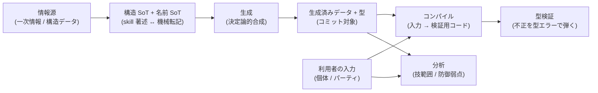

# pokeform 設計俯瞰（design index）

pokeform は「Pokemon as Code」な TypeScript npm モジュール（ポケモンチャンピオンズ対応）。
育成済み個体の管理とパーティ構築支援を、**コーディングエージェントが pnpm で機械的に検証しながら**
ブラッシュアップできる土台を提供する。

このディレクトリ（`docs/design/`）は **設計の俯瞰（Explanation 象限）** を担う。「なぜこの形なのか」
「全体はどう成り立つのか」「層はどう責務を分けるのか」を**自然言語と図**で説明する場であり、
**TypeScript の具体コード・型シグネチャ・YAML キー・数式・CLI フラグは置かない**（それらの正本は
`src/` 実装と path-scoped rule にある）。design は「乖離しにくいもの」だけを持つ可変スナップショットで、
正確さが要る値は必ず実装 SoT へ誘導する（→ 末尾「実装 SoT ポインタ」）。背景は [ADR 0038](../adr/0038-docs-placement-and-front-matter.md)。

## 何をどこで読むか（配置の原則）

知識の種類ごとに正本（SoT）を一意化し、他層はそれを**再記述せず参照する**（point, don't repeat）。

| 知りたいこと | 読む場所 |
|---|---|
| 設計の俯瞰・なぜ・データフロー・層の責務 | **`docs/design/`（ここ・コードなし）** |
| 規約・具体値・契約（型表現・ゲーム数値・テスト方針） | `.claude/rules/*`（1 rule = 1 正本） |
| 手順・チェックリスト | `.claude/skills/*` |
| いつ・なぜ決めたか・捨てた代替案 | `docs/adr/*`（不変ログ） |
| 型・スキーマ・数式・閾値そのもの | `src/`（tsc / カバレッジ100% / `check:*` が機械保証） |
| 何をどの順で作るか・進捗 | `docs/plan/`（計画・進捗） |

`design`（なぜ・どう成り立つか）と plan（何をどの順で・進捗）は**役割が分かれる**: 前者は plan 進捗に
左右されない設計スナップショット、後者は実装計画と進捗のログ。

## 設計方針（5 点の意図）

確定済みの設計方針を「なぜそうしたか」で要約する（具体値・コードは持たない）。

1. **検証は tsc のみ**（実行時バリデーションを採用しない）。入力 YAML/MD を生成 TS に変換し、不正を
   **型エラー**として弾く。実行時ライブラリを足さず、検証ゲートを 1 つ（型チェック）に絞ることで、
   オフライン・決定論的・エージェントが機械的に回せる検証を実現する。→ [[tsc-verification]]
2. **Linter / Formatter = Biome**（設定 1 ファイル）。整形・lint を一体化し設定の分散を避ける。
3. **外部データは vendor 方式**（取得 → 整形 → 生成物をコミット）。実行時に外部 API へ依存せず、
   オフライン・決定論・CI 高速を優先する。取得キャッシュのみ追跡対象外。→ [[data-pipeline]]
4. **テストカバレッジは最初から完全網羅**。エージェント実装前提のため最高基準を初手から強制し、
   ドメインロジックの抜けを機械ゲートで塞ぐ。薄い配線層は明示除外する。→ [[testing]]
5. **レビューは機械ゲートと意味的レビューの二層**。型 / カバレッジ / Biome は Git hooks + CI が強制し、
   その上に PR マージ前の意味的レビューを重ねる。観点が本質的に異なるソース用とハーネス資産用に
   レビューを分ける。

## 全体データフロー（俯瞰）

情報源から検証までの流れを抽象語で示す（具体ファイル名・キーは各テーマ doc と実装 SoT が持つ）。

左半分（情報源 → 生成データ）が **データ取得・管理**、右半分（利用者入力 → 検証 / 分析）が
**型検証**と**個体・パーティ管理**にあたる。詳細は次節のテーマ別 doc へ。

## テーマ別ナビ

- [data-pipeline.md](./data-pipeline.md) — データ取得・管理の仕組み（情報源 3 系統・SoT の分担・生成の決定論性）。
- [type-validation.md](./type-validation.md) — 型バリデーションの仕組み（tsc を唯一ゲートにする考え方・ブランドエラー型・巨大 union 回避）。
- [individuals-and-parties.md](./individuals-and-parties.md) — 個体・パーティ管理が保証する不変条件（技 / 特性 / ポイント / 重複 / 解禁 / 体数）と分析が答える問い。

## 主要トレードオフ

- **tsc のみ検証**: 構造制約（技 / 特性 / 性格 / 重複 / レギュ解禁）は型で自然に弾けるが、合計値の
  ような算術制約は型レベルでは重い。重い部分は生成段で先に計算して型注釈へ逃がし、検証ゲートは
  型チェック 1 つに保つ。
- **生成データのコミット（vendor）**: リポジトリは肥大化するが、オフライン・決定論・CI 速度を優先する。
- **巨大なエンティティ集合**: 種族・技などの ID 集合が大きく union 分配のコストが懸念されるため、
  集約表からのプロパティアクセス主体で制約し、性能問題を回避する。
- **設計俯瞰の可変性**: design は最新性を機械保証しない可変スナップショット。正確さが要る値は必ず
  実装 SoT（機械ゲート下の `src/` / rule）を正本とし、design はそこへ誘導する。

## 参考ソース

ゲーム仕様・データの一次情報。

- ポケモン徹底攻略「SVからの変更点」 https://yakkun.com/ch/changes.htm
- 能力ポイント仕様 https://yakkun.com/ch/stat_points.htm
- Pokemon Champions stat points guide https://genpkm.com/blog/pokemon-champions-no-ivs-stat-points-competitive-guide-2026
- 対戦フォーマット（Game8） https://game8.co/games/Pokemon-Champions/archives/588873

## 実装 SoT ポインタ

design は俯瞰のみ。具体値・型・数式・手順の正本は以下にある。

- 規約・具体値: [[data-pipeline]] / [[type-conventions]] / [[testing]] / [[tsc-verification]] / [[game-spec]] / [[cli-and-io]]（`.claude/rules/`）。
- 決定の「なぜ」: [`docs/adr/`](../adr/)（一覧は [README](../adr/README.md)）。
- 型・スキーマ・数式の機械保証 SoT: `src/`（`src/types/` / `src/domain/` / `src/codegen/` / `src/io/` / `src/generated/`）。
- データ取得・生成スクリプト: `scripts/`。
- 構造 / 名前の入力 SoT: `data/champions/` / `data/languages/`。
