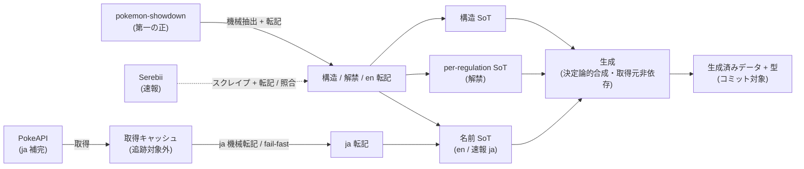

# データ取得・管理の仕組み

pokeform のデータは、外部の取得元を **vendor 方式**（取得 → 整形 → 生成物をコミット）で取り込み、
利用時には外部 API へ一切依存しない形に固める。この doc はその**全体像と設計意図**を説明する
（具体的なファイル名・スキーマ・コマンドは持たない。正本は末尾「実装 SoT ポインタ」へ）。

## なぜ vendor 方式か

実行時に外部サービスへ問い合わせず、**オフライン・決定論的・CI 高速**であることを優先する。
取得済みデータと生成済みデータをリポジトリにコミットし、検証・分析はそのスナップショットだけで完結する。
外部取得のキャッシュのみ追跡対象から外す。取得元が変わっても vendor 運用は不変（[ADR 0039](../adr/0039-showdown-authoritative-pokeapi-ja-only.md)）。

## 取得元は 3 経路（権威序列）

データの取得元は性質の異なる 3 経路で、それぞれ信頼度と役割が違う（[ADR 0039](../adr/0039-showdown-authoritative-pokeapi-ja-only.md) /
[ADR 0040](../adr/0040-serebii-provisional-scraper-rebuild.md)）。権威序列は **showdown(正) > Serebii(速報) > PokeAPI(ja 補完)**。

1. **pokemon-showdown = 第一の正（authoritative）** — 解禁・構造・技メタ・メガ・持ち物を一括かつ機械可読に持つ
   対戦シミュレーターの mod。`calculatePP` 等 Champions 固有仕様まで内包する。構造データ + 解禁データの取得元で、
   GitHub Actions で clone → build → 抽出して YAML 更新 PR を自動作成する。
2. **Serebii = 速報（provisional）** — 公式更新の反映が早く、各ページに日本語名を持つ。GitHub Actions で
   スクレイプして速報 PR を立てる。showdown が追いついたら上書きされる暫定値で、showdown PR の正確性を機械照合
   （`verify-showdown-pr`）する独立ソースも兼ねる。
3. **PokeAPI = ja 補完** — showdown が持たない日本語名 ja の取得元（`names` ja-Hrkt）。構造取得は廃止し ja 専任。

## 2 つの辺 — 機械抽出 / スクレイプ ↔ ja 機械転記

3 経路の取得元は、**性質の違う辺**を通って入力 SoT に合流する。判断（解禁・技メタ）も含めて取得元が機械可読に
保持するため、showdown / Serebii 経路は **機械抽出 + 転記**、PokeAPI 経路は **ja 機械転記**で取り込む。

- **showdown / Serebii の辺**: 取得元（showdown mod / Serebii ページ）→ 機械抽出 / スクレイプ → 純関数転記で
  構造 SoT・per-regulation SoT・名前 SoT へ書き込む。showdown は正（en も供給）、Serebii は速報（ja / en も埋める）。
  正の正確性は Serebii スクレイパーで機械照合して裏取りする（[ADR 0039](../adr/0039-showdown-authoritative-pokeapi-ja-only.md)）。
- **PokeAPI ja の辺**: PokeAPI `names` → キャッシュ → 機械転記で名前 SoT の **ja のみ** を fail-fast で補完する
  （[ADR 0039](../adr/0039-showdown-authoritative-pokeapi-ja-only.md)）。

## 3 つの SoT — それぞれ「何の正本」か

入力側の SoT は 3 つの直交する関心でディレクトリを分ける（[ADR 0035](../adr/0035-specs-languages-layout-redesign.md)）。
何の正本かを混ぜないことで、仕様変更時に直す場所が一意になる。

- **構造 SoT** — 種族値・タイプ・特性・図鑑番号・持ち物分類・技メタといった、**言語に依存しない構造値**の正本。
  名前は持たない。ゲーム別。
- **名前 SoT** — 各エンティティの日英名（id → 日本語 / 英語）の正本。**ゲームに依存しない**。逆引き（名前 → id）は
  この前方マップから実行時に導出し、専用の逆引きデータを別に持たない。
- **per-regulation SoT** — レギュレーションごとの解禁集合（解禁種族・per-種族の使える技・解禁持ち物・メガ）の正本。
  解禁はレギュレーション側を一本の正本とし、種族側に解禁フラグを散らさない（[ADR 0021](../adr/0021-per-regulation-species-and-legality.md)）。

メガは base 種族から構造データを分離した**独立エンティティ**として持ち、base 種族への逆参照で関係づける
（命名規約への暗黙依存をやめ、エンティティ型で base / メガを判別する。[ADR 0036](../adr/0036-mega-independent-spec-entity.md)）。

## 生成の決定論性

生成段は、3 つの入力 SoT（構造 / 名前 / per-regulation）を**変換・合成**して、値と型を備えた生成物を出力する。
このとき**取得キャッシュを読まない**。入力 SoT だけを源にすることで、同じ入力からは常に同じ生成物が得られる
（決定論的・[ADR 0035](../adr/0035-specs-languages-layout-redesign.md)）。生成物は値として出力し、そこから型を派生して
値と型を単一ソース化する（二重管理を避ける。詳細は [[type-conventions]]）。

整理すると、データは次の順に流れる: **情報源（3 系統）→ 2 つの辺で入力 SoT（構造 / 名前 / per-reg）へ合流
→ 決定論的合成 → 生成済みデータ + 型（コミット）→ 検証 / 分析が利用**。

## 実装 SoT ポインタ

この doc は俯瞰のみ。具体的なファイル構成・スキーマ・コマンド・転記ロジックの正本は以下。

- 規約・レイアウト・具体値・取得元の権威序列: [[data-pipeline]]（`.claude/rules/data-pipeline.md`）。型と値の単一ソース化は [[type-conventions]]。
- showdown PR の Serebii 照合手順: [`verify-showdown-pr`](../../.claude/skills/verify-showdown-pr/SKILL.md)。
  日本語名 ja の取り込み手順: [`update-catalog`](../../.claude/skills/update-catalog/SKILL.md)。
- 取得・転記・生成スクリプト: `scripts/`（`scripts/showdown/*`（抽出）/ `sync-showdown.ts` / `scrape-serebii.ts` / `sync-serebii.ts` / `fetch-pokeapi.ts` / `materialize.ts` / `generate.ts`）。純関数は `src/codegen/{showdown,serebii}/*`。
- GitHub Actions: `.github/workflows/showdown-sync.yml`（正）/ `serebii-bulletin.yml`（速報）。
- 入力 SoT（構造 / 名前 / per-regulation）: `data/champions/` / `data/languages/`。
- 生成物: `src/generated/`。
- 決定の「なぜ」: [ADR 0039](../adr/0039-showdown-authoritative-pokeapi-ja-only.md)（showdown 第一の正・PokeAPI ja 専任）/
  [ADR 0040](../adr/0040-serebii-provisional-scraper-rebuild.md)（Serebii 速報降格・スクレイパー刷新）/
  [ADR 0021](../adr/0021-per-regulation-species-and-legality.md) / [ADR 0035](../adr/0035-specs-languages-layout-redesign.md) /
  [ADR 0036](../adr/0036-mega-independent-spec-entity.md)（一覧は [README](../adr/README.md)）。
