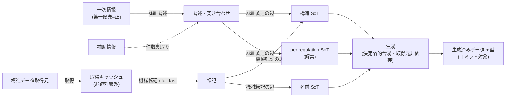

# データ取得・管理の仕組み

pokeform のデータは、外部の一次情報を **vendor 方式**（取得 → 整形 → 生成物をコミット）で取り込み、
利用時には外部 API へ一切依存しない形に固める。この doc はその**全体像と設計意図**を説明する
（具体的なファイル名・スキーマ・コマンドは持たない。正本は末尾「実装 SoT ポインタ」へ）。

## なぜ vendor 方式か

実行時に外部サービスへ問い合わせず、**オフライン・決定論的・CI 高速**であることを優先する。
取得済みデータと生成済みデータをリポジトリにコミットし、検証・分析はそのスナップショットだけで完結する。
外部取得のキャッシュのみ追跡対象から外す。背景は [ADR 0012](../adr/archive/0012-vendor-pokeapi-data.md)。

## 情報源は 3 系統

データの源は性質の異なる 3 系統で、それぞれ信頼度と役割が違う。

1. **一次情報（第一優先＝正）** — レギュレーションの解禁情報（解禁種族・各種族が使える技・技メタ・
   解禁持ち物・メガ可否）の正。判断を伴うため、後述の「skill 著述の辺」で人が突き合わせて著述する。
2. **補助（裏取り）** — 件数・名称の突き合わせに使う二次情報。一次情報の確からしさを補強する用途に限る。
3. **構造データ取得元** — 種族値・タイプ・特性・図鑑番号・持ち物分類といった、判断の要らない構造値の
   取得元。後述の「機械転記の辺」で機械的に取り込む。

一次情報と補助の役割・優先順位の正本は [`survey-regulation` の serebii-sourcing](../../.claude/skills/survey-regulation/references/serebii-sourcing.md)。

## 2 つの辺 — skill 著述 ↔ 機械転記

3 系統の情報源は、**性質の違う 2 本の辺**を通って入力 SoT に合流する。この分離が「判断の要る部分」と
「機械でよい部分」を取り違えないための設計の要点。

- **skill 著述の辺**: 一次情報 + 補助 → 人が突き合わせて構造 SoT と per-regulation データへ著述する。
  解禁・使える技・技メタのような**判断と出典確認を伴う情報**はここを通す。構造データ取得元を技の信頼源に
  せず一次情報を優先する（[ADR 0037](../adr/archive/0037-serebii-move-master-dedicated-path.md)）。
- **機械転記の辺**: 構造データ取得元 → キャッシュ → 機械転記で構造 SoT と名前 SoT へ書き込む。
  **判断の要らない構造値・名前**はここを通し、fail-fast で取りこぼしを検出する
  （[ADR 0027](../adr/archive/0027-structural-data-catalog-sot.md)）。

## 3 つの SoT — それぞれ「何の正本」か

入力側の SoT は 3 つの直交する関心でディレクトリを分ける（[ADR 0035](../adr/0035-specs-languages-layout-redesign.md)）。
何の正本かを混ぜないことで、仕様変更時に直す場所が一意になる。

- **構造 SoT** — 種族値・タイプ・特性・図鑑番号・持ち物分類・技メタといった、**言語に依存しない構造値**の正本。
  名前は持たない。ゲーム別。
- **名前 SoT** — 各エンティティの日英名（id → 日本語 / 英語）の正本。**ゲームに依存しない**。逆引き（名前 → id）は
  この前方マップから実行時に導出し、専用の逆引きデータを別に持たない。
- **per-regulation SoT** — レギュレーションごとの解禁集合（解禁種族・per-種族の使える技・解禁持ち物・メガ）の正本。
  解禁はレギュレーション側を一本の正本とし、種族側に解禁フラグを散らさない（[ADR 0021](../adr/0021-per-regulation-species-and-legality.md)）。

メガは base 種族から構造データを分離した**独立エンティティ**として持ち、base 種族への逆参照で関係づける
（命名規約への暗黙依存をやめ、エンティティ型で base / メガを判別する。[ADR 0036](../adr/0036-mega-independent-spec-entity.md)）。

## 生成の決定論性

生成段は、3 つの入力 SoT（構造 / 名前 / per-regulation）を**変換・合成**して、値と型を備えた生成物を出力する。
このとき**取得キャッシュを読まない**。入力 SoT だけを源にすることで、同じ入力からは常に同じ生成物が得られる
（決定論的・[ADR 0035](../adr/0035-specs-languages-layout-redesign.md)）。生成物は値として出力し、そこから型を派生して
値と型を単一ソース化する（二重管理を避ける。詳細は [[type-conventions]]）。

整理すると、データは次の順に流れる: **情報源（3 系統）→ 2 つの辺で入力 SoT（構造 / 名前 / per-reg）へ合流
→ 決定論的合成 → 生成済みデータ + 型（コミット）→ 検証 / 分析が利用**。

## 実装 SoT ポインタ

この doc は俯瞰のみ。具体的なファイル構成・スキーマ・コマンド・転記ロジックの正本は以下。

- 規約・レイアウト・具体値: [[data-pipeline]]（`.claude/rules/data-pipeline.md`）。型と値の単一ソース化は [[type-conventions]]。
- 一次情報の優先順位・著述手順: [`survey-regulation`](../../.claude/skills/survey-regulation/SKILL.md) と
  その [serebii-sourcing](../../.claude/skills/survey-regulation/references/serebii-sourcing.md) / [`update-catalog`](../../.claude/skills/update-catalog/SKILL.md)。
- 取得・転記・生成スクリプト: `scripts/`。
- 入力 SoT（構造 / 名前 / per-regulation）: `data/champions/` / `data/languages/`。
- 生成物: `src/generated/`。
- 決定の「なぜ」: [ADR 0012](../adr/archive/0012-vendor-pokeapi-data.md) / [ADR 0021](../adr/0021-per-regulation-species-and-legality.md) /
  [ADR 0027](../adr/archive/0027-structural-data-catalog-sot.md) / [ADR 0035](../adr/0035-specs-languages-layout-redesign.md) /
  [ADR 0036](../adr/0036-mega-independent-spec-entity.md) / [ADR 0037](../adr/archive/0037-serebii-move-master-dedicated-path.md)（一覧は [README](../adr/README.md)）。
