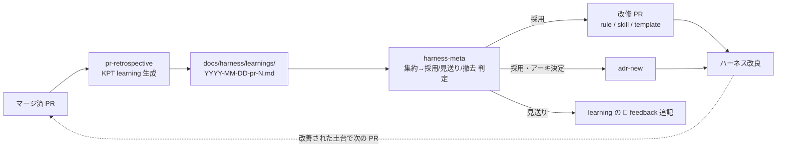

# docs/harness — ハーネス自己改良ループ

pokeform を Claude Code / Codex が**繰り返し・信頼性高く**実装するための土台（ハーネス）のうち、
**PR ごとの学びをハーネスへ書き戻す自己改良ループ**を司る場所。learning の蓄積と、その採用判定の記録を置く。

> ハーネス全体の役割分担表は [`../roadmap/completed/00-harness-setup/README.md`](../roadmap/completed/00-harness-setup/README.md) を参照。
> 本ループの設計意図は phase doc [`phase-02-retrospective-loop.md`](../roadmap/completed/00-harness-setup/phase-02-retrospective-loop.md)。

## ループ全体像

二段構え:

1. **`pr-retrospective`**（1 PR = 1 learning）: マージ済 PR から KPT（Keep / Problem / Try）learning を生成し、
   `🤖 ハーネス改善提案` を 5 プレフィックス（`[rule]` / `[skill]` / `[template]` / `[adr]` / `[remove]`）で起票する。
2. **`harness-meta`**（複数 learning 集約）: 未処理提案を集約 parse し、
   [採用 / 見送り / 撤去](../../.claude/rules/harness-meta-criteria.md) を判定して
   改修 PR / ADR / feedback 追記へ振り分ける。**merge は人間 approve**。

> **位置づけ**: 本ループは**稼働中**。`00-harness-setup` の整備完了後、MVP（`01-mvp`）以降の各 PR で
> `pr-retrospective` が learning を生成し（`learnings/` に多数蓄積済み）、`harness-meta` が集約してハーネスへ
> 書き戻している。最新の learning / status は [`learnings/INDEX.md`](./learnings/INDEX.md) を参照。

## 構成

| パス | 役割 |
|---|---|
| [`learnings/INDEX.md`](./learnings/INDEX.md) | learning 索引（PR番号 / タイトル / 生成日 / 関連 Plan / status） |
| [`learnings/template.md`](./learnings/template.md) | learning 雛形（`retrospective-format` 準拠） |
| [`learnings/YYYY-MM-DD-pr-<n>.md`](./learnings/) | 各 PR の learning 実体（実装 PR 以降に生成） |
| [`.claude/rules/retrospective-format.md`](../../.claude/rules/retrospective-format.md) | learning 構造の SoT |
| [`.claude/rules/harness-meta-criteria.md`](../../.claude/rules/harness-meta-criteria.md) | 採用 / 見送り / 撤去 判定基準 |
| [`.claude/rules/redaction.md`](../../.claude/rules/redaction.md) | Secrets / PII の `[REDACTED-*]` 置換規約 |
| [`.claude/skills/pr-retrospective/`](../../.claude/skills/pr-retrospective/) | learning 生成 skill（canonical） |
| [`.claude/skills/harness-meta/`](../../.claude/skills/harness-meta/) | 集約→書き戻し skill（canonical） |

## 運用メモ

`00-harness-setup` の整備完了に伴い、かつて前方参照だった依存（ADR / finish-phase / CLAUDE.md）はすべて
実体に反映済み。現在の運用は次のとおり:

- **ブランチ命名**: learning の集約 PR は `harness/learnings-batch-YYYY-WW`（週次 / 件数閾値）、
  個別のハーネス改修 PR は `harness/<purpose>`（命名規約は `AGENTS.md` / [[cross-agent]]）。
- **起動導線**: 自動起動は不採用（将来送り）。手動起動、または `finish-phase` skill 末尾の
  「PR merge 後に `pr-retrospective` を起動」促しに乗せる。
- **ADR 連携**: `🚀 Try` のアーキ決定は `[adr]` 提案 → `adr-new` で起票。
  本ループ導入自体は ADR [`0015-kpt-retrospective-loop`](../adr/0015-kpt-retrospective-loop.md)。
- **CLAUDE.md**: 本ループの要約は `CLAUDE.md` / `AGENTS.md` に反映済み。
- **集約 / dry-run**: batch 集約は週次 or 件数閾値（既定 10）。リスキー変更は軽量 dry-run メモのみ
  （定量 dry-run は不採用）。

## スコープ外（将来送り）

- cron / 閾値による自動起動・orchestrator 連携。
- 三層メトリクス・定量 dry-run（golden-set / N≥10）。
- 外部研究駆動の `harness-evolution` skill。
- learning の機械検証 CI（frontmatter / プレフィックス検証）。
