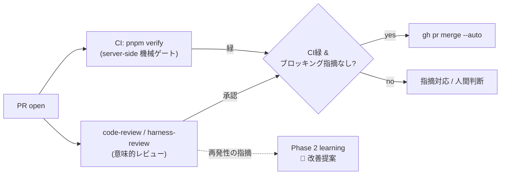

# Phase 3 — コードレビュー Skill（PR マージ前の意味的レビュー）

## 目的 / スコープ

機械ゲート（Phase 9 の Git hooks: `tsc` / カバレッジ100% / Biome）と、merge **後**の KPT 振り返り（Phase 2 の `pr-retrospective`）の間に欠けている「**PR マージ前の、判断を要する意味的レビュー**」層を補う。エージェントが各 PR を定型観点でレビューし、**機械ゲート緑＋レビュー承認なら auto-merge** できる状態にする。

文献調査の結論として、**ソースコードのレビュー観点とハーネス資産のレビュー観点は本質的に異なる**ため、スキルを 2 つに分割する:

- **`code-review`**: `src/**` / `scripts/**` 等のライブラリ本体・データパイプラインを、Google eng-practices の 12 観点 + AI 生成コード固有観点 + pokeform 固有規約でレビュー。
- **`harness-review`**: `.claude/rules` / `.claude/skills` / `AGENTS.md` / `CLAUDE.md` / `.githooks` / `docs/plan` / `docs/adr` 等のハーネス資産を、trigger 精度・クロスエージェント整合・SoT 一貫性・redaction・paths スコープ等でレビュー。

本レビューは**提案的**であり、機械ゲートが緑にした項目（型/カバレッジ/Biome）は**再実行しない**。機械ゲートで捕れない層（仕様忠実性・設計・安全性・整合性）に専念する。

> **レビュー観点の根拠（文献）**
>
> - **ソース（`code-review`）**: Google eng-practices「What to look for」(Design/Functionality/Complexity/Tests/Naming/Comments/Style/Consistency/Documentation/Every Line/Context/Good Things、基準は「完璧さでなくコード健全性の純改善」) / AI 生成コードのレビュー差分（仕様忠実性 precise≠plausible・エッジ/エラー処理・セキュリティは高リスク既定・前提の安全性・表面品質の罠）/ IaC・設定資産のレビュー差分（規約準拠・誤設定/秘匿情報の混入・スコープ正しさ）。
> - **ハーネス資産（`harness-review`）**: ハーネスは rules / skills / `AGENTS.md` / `CLAUDE.md` / hooks＝**エージェント指示（プロンプト）資産**であり、コードとは別の観点が要る。
>   - **Agent Skills（Anthropic 公式）**: `description` は「何をするか＋いつ使うか」を三人称で、under-trigger 回避のため少し "pushy" に（≤1024 字・XML 不可）。**progressive disclosure**（肥大化したら別ファイルに分割し参照）。「`ALWAYS`/`NEVER`/`MUST` の羅列」より「**ルール＋なぜ**」が未知ケースへ汎化する。eval 駆動で反復。
>   - **AGENTS.md**: 短く（目安 ≤300 行）・**普遍的でない指示を混ぜない**（指示は ~150–200 が信頼上限、希釈を避ける）・スタイル規約は linter/formatter に委ね指示に書かない・進捗詳細は別ファイルへ**ポインタ化**・decision table と 3–10 行の実コード片で曖昧さ解消・「詰まったら確認を求める」を明示。
>   - **コンテキストエンジニアリング（Anthropic）**: 「**right altitude**（ハードコード過ぎず曖昧過ぎない Goldilocks ゾーン）」「目的を最大化する**最小の高シグナルトークン集合**」「明示・構造化」。

## 前提（依存）

本フェーズは Phase 2 と同じく**「仕掛けの設置」**であり、実稼働は依存が揃い PR が流れ始めてから（**設置 ≠ 即時稼働**）。早期に番号を置くのは、後続のハーネスフェーズ（Phase 4 以降）や MVP の PR を**レビュー対象にできるようにする**ため。

- Phase 7（`cross-agent.md` / `skill-authoring.md` rule・レビュー対象となる rules / `AGENTS.md` / `CLAUDE.md` の実在）。
- Phase 8（skill 基盤・`finish-phase` の促し導線に乗せる先）。
- Phase 9（機械ゲートとの責務境界の基準・`Bash(gh pr *)` 権限）。
- Phase 4（本フェーズの決定を ADR `0010-semantic-code-review-skills` として記録）。
- Phase 2（再発性のあるレビュー指摘を learning の `🤖 改善提案` へ流す連携先）。
- **bootstrap の注記**: レビュー skill は自身の依存（Phase 7/8/9）が揃って初めて後続フェーズ PR を実レビューできる。auto-merge は server-side CI と branch protection（後述・後続で導入）が前提のため、それらが整って以降の PR に適用される。

## タスク

> **クロスエージェント共有（全スキル共通）**: 各スキルは **`skill-creator` skill を使って** `.claude/skills/<name>/SKILL.md` に canonical（実体）を作成し、`.agents/skills/<name>` を `../../.claude/skills/<name>` への symlink にして Codex と共有する。`description` は trigger（いつ起動するか）を明示。symlink 不可環境は copy 同期にフォールバック（`skill-authoring.md`／`cross-agent.md`／Phase 7）。

### A. rule（共通 SoT）

- [ ] `.claude/rules/code-review.md`（paths: `src/**`, `scripts/**`, `.claude/**`, `docs/**`, `AGENTS.md`, `CLAUDE.md`／レビュー時に参照）: 両 skill・両 checklist の SoT。
  - レビュー基準: **「完璧さでなくコード健全性の純改善」**（Google eng-practices）。
  - **機械ゲート非再実行原則**: 型/カバレッジ/Biome は Phase 9 の責務。再チェックせず意味的観点に限定。
  - 出力フォーマット（指摘の重大度: blocking / non-blocking / nit、ファイル:行、根拠）。
  - effort 段階の意味（low/medium=高確度の少数指摘、high=広め）。
  - redaction は `redaction.md`（Phase 2）を参照。

### B. skills（canonical + `.agents` symlink・`skill-creator` を使って作成）

- [ ] `.claude/skills/code-review/SKILL.md` + `references/code-review-checklist.md` + `.agents/skills/code-review` symlink。
  - frontmatter: `description`（「`src/**`・`scripts/**` を変更した PR / diff をレビューしたいとき。ハーネス設定の変更は `harness-review` を使う」=トリガと SKIP を明示）、`allowed-tools: Bash(git *) Bash(gh pr *) Read Grep`（**指摘のみ・書込なし**）。
  - 手順: 対象 diff を収集（`gh pr diff` or `git diff`）→ paths から観点を選択 → checklist で評価 → 重大度付き指摘を要約。
- [ ] `.claude/skills/harness-review/SKILL.md` + `references/harness-review-checklist.md` + `.agents/skills/harness-review` symlink。
  - frontmatter: `description`（「`.claude/rules`・`.claude/skills`・`AGENTS.md`・`CLAUDE.md`・`.githooks`・`docs/plan`・`docs/adr` を変更した PR をレビューしたいとき。ソース変更は `code-review` を使う」）、`allowed-tools` は同上。
- [ ] **既存組み込み `code-review` skill との名前衝突確認**（衝突するなら `src-review` 等へ改名し、本 doc / README の表記も合わせる）。

### C. checklist references（≤500 行本体から分離）

SKILL.md 本体は手順とトリガに絞り、長い観点リストは `references/` に逃がす（Phase 8 の「SKILL.md ≤500 行・詳細は supporting ファイル」方針に準拠）。下記「paths × レビュー観点」表を反映する。

- [ ] `code-review-checklist.md`: Google 12 観点 / AI 生成コード観点 / pokeform 固有（tsc 型設計規約・カバレッジ100% の質・ブランドエラー型）/ paths 別適用表。
- [ ] `harness-review-checklist.md`（文献根拠を併記）:
  - **skills**: `description` が「何を＋いつ」を三人称・under-trigger 回避（≤1024 字・XML 不可）/ progressive disclosure（≤500 行・長い手順は references へ）/ 「ルール＋なぜ」優先（`ALWAYS/NEVER/MUST` 羅列を避ける）/ allowed-tools 最小権限。（Agent Skills 公式）
  - **AGENTS.md / CLAUDE.md**: 短さ（目安 ≤300 行）・普遍的でない指示の混入なし・スタイル規約は linter 委譲（指示に書かない）・詳細はポインタ化・SoT 一貫性（AGENTS=指示 SoT / CLAUDE=`@AGENTS.md` 薄アダプタ）。（AGENTS.md ベストプラクティス）
  - **rules**: paths スコープ過不足 / 既存 rule 非矛盾 / 「right altitude」（ハードコード過ぎ・曖昧過ぎを避ける）/ 最小高シグナル。（context engineering）
  - **共通**: クロスエージェント整合（canonical+symlink パリティ）/ redaction / ゲート二重化チェック。

### D. auto-merge ゲート（本フェーズの主目的）

- [ ] **依存の明記**: GitHub の auto-merge は **server-side の required status check** が必須。現状 CI（GitHub Actions）は未整備（Phase 6 Docker に想定コメント、Phase 10 dependabot は github-actions ecosystem 登録のみ）。本フェーズの前提タスクとして以下を記載:
  - [ ] `.github/workflows/ci.yml`: コンテナ内で `pnpm verify` を実行（Phase 6 の `Dockerfile` を再利用）。**ローカル Git hooks は GitHub の merge を gate しない**ため、server-side チェックを別途用意する。
  - [ ] branch protection: `ci` を required check に設定 + 承認 1 を要求。
- [ ] **auto-merge フロー**: PR open → CI `pnpm verify`（server 機械ゲート）→ エージェントが `code-review` / `harness-review` を実行し指摘 or 承認 → **CI 緑 ＆ ブロッキング指摘なし**なら `gh pr merge --auto --merge`（通常マージ＝merge commit）。
- [ ] 承認条件と approve 主体（人間 or 明示ルール）を doc 内で明文化。レビューは提案的であり、最終 approve をどこに置くかを定義する。

### E. 連携

- [ ] `finish-phase` skill（Phase 8）の促し系列に「PR open 時に `code-review` / `harness-review` を起動」する 1 行をメモ（本フェーズは導線記述のみ。実装は Phase 8 側）。
- [ ] 再発性のあるレビュー指摘は Phase 2 learning の `🤖 ハーネス改善提案`（`[rule]` / `[skill]`）へ**一方向**に流す導線を記述（Phase 2 doc は書き換えない）。`pr-retrospective` は既に PR review コメントを収集するため、指摘は自然に learning の素材になる。

## paths × レビュー観点（references に記載する骨子）

| paths | 担当 skill | 重点観点 |
|---|---|---|
| `src/types/**`, `data/generated/**` | code-review | `XxxBase`+`XxxDex`+`XxxId=keyof XxxDex` パターン / 種族粒度 / 生成物への手編集混入 |
| `src/codegen/**` | code-review | tsc のみ検証方針 / ブランドエラー型命名 / 合計66 を codegen 算出 / 決定性 |
| `src/domain/**` | code-review | HP/非HP 計算式（二重 floor）/ ポイント 66・32 / 性格 ±10% / **境界・エラー処理（AI 見落とし最頻）** |
| `src/cli/**`, `src/io/**` | code-review | `lang: ja\|en` / `--lang` / 終了コード / **外部入力検証・エラー処理（高 risk 既定）** |
| `**/*.test.ts`, `__fixtures__/` | code-review | コロケーション / カバレッジ100% が境界を突くか / AI 生成テストの plausible≠correct |
| `scripts/**`, `data/raw\|champions\|overrides` | code-review（設定/IaC 観点） | data-pipeline 規約 / vendor 方針 / **秘匿情報のプレーンテキスト混入・スコープ** |
| `.claude/rules/**` | harness-review | paths スコープ過不足 / 既存 rule 非矛盾 / 要点再記述＋`architecture.md` ポインタ |
| `.claude/skills/**`, `.agents/skills/**` | harness-review | description=「何を＋いつ」三人称・under-trigger 回避（≤1024字） / ≤500 行・progressive disclosure / 「ルール＋なぜ」（`ALWAYS/NEVER` 羅列回避） / **canonical+symlink パリティ** / allowed-tools 最小権限 |
| `AGENTS.md`, `CLAUDE.md` | harness-review | 短さ（≤300 行目安）・普遍的でない指示の混入なし・スタイルは linter 委譲 / SoT 一貫性（AGENTS=指示 SoT / CLAUDE=`@AGENTS.md` 薄アダプタ）/ 詳細はポインタ化・32KiB 意識 |
| `.githooks/**`, `.claude/settings.json`, `.claude/hooks/**` | harness-review | ゲート二重化していないか / 実行権限前提 / 設定値の妥当性・秘匿情報非混入 |
| `docs/plan/**`, `docs/adr/**`, `docs/harness/**` | harness-review | phase テンプレ準拠 / 相互参照（前提節）の整合 / ADR 採番・supersede / learning の redaction / 生成物の手編集 |

## 受け入れ基準

- `code-review` / `harness-review` が `.claude/skills`（実体）と `.agents/skills`（symlink）の両方から同一 SKILL.md で起動できる。
- SKILL.md 本体が各 ≤500 行で、観点チェックリストは `references/` に分離されている。
- `description` が paths / トリガを明示し、誤起動（src 変更で `harness-review` が起きる等）しない。
- 機械ゲート（型 / カバレッジ / Biome）を再実行せず、それで捕れない層のみ指摘する設計である。
- 既存の組み込み skill と名前が衝突しない（衝突時は改名済み）。
- auto-merge が「CI 緑 ＋ レビュー承認」で動作し、どちらかが欠けると止まる。
- README のフェーズ一覧・役割分担表・受け入れ基準に本フェーズが反映されている。
- ADR `0010-semantic-code-review-skills` が存在し、`architecture.md` と二重記述になっていない。

## 検証手順

1. `src/` を変更したダミー diff に `code-review` → Google 12 観点 + AI 生成コード観点 + pokeform 固有観点で指摘が返り、機械ゲート項目は再実行しない。
2. `.claude/rules/*` を変更したダミー diff に `harness-review` → symlink パリティ / paths スコープ / SoT 一貫性の指摘が返る。
3. `data/` に故意に秘匿情報を混ぜた変更 → redaction / 秘匿混入として指摘される。
4. CI 失敗の PR で auto-merge が止まり、CI 緑＋承認で `--auto` 予約されることを確認。
5. 両 skill が `.agents/skills` 経由（Codex 想定）でも起動できる。

## リスク・備考

- 提案的レビューを強制ゲートと誤認させない。最終 approve は人間（または明示ルール）。
- Phase 9 の Git hooks と二重化しない（機械項目は再実行しない）。
- `description` 過広トリガによる誤起動 → paths 明示と「SKIP 条件」記述で抑制。
- レビューの実稼働は依存（Phase 7/8/9）が揃ってから（bootstrap）。auto-merge は server-side CI と branch protection が前提（ローカル hooks は GitHub の merge を gate しない）。
- 観点チェックリストの肥大は `references/` 分割で本体 ≤500 行を維持。

## 参考

**ソース（`code-review`）**

- Google eng-practices — [What to look for in a code review](https://google.github.io/eng-practices/review/reviewer/looking-for.html) / [The Standard of Code Review](https://google.github.io/eng-practices/review/reviewer/standard.html)。
- AI 生成コードのレビュー観点 — [Graphite](https://www.graphite.com/guides/how-to-review-code-written-by-ai) / [GitHub Docs](https://docs.github.com/en/copilot/tutorials/review-ai-generated-code) / [Bright Security](https://brightsec.com/blog/5-best-practices-for-reviewing-and-approving-ai-generated-code/)（仕様忠実性・エッジ/エラー処理・セキュリティ高リスク既定・前提の安全性）。
- IaC / 設定資産のレビュー観点 — [Microtica](https://www.microtica.com/blog/how-to-complete-infrastructure-code-reviews-like-a-pro) / [IBM](https://www.ibm.com/think/insights/infrastructure-as-code-best-practices)（規約準拠・誤設定/秘匿情報・スコープ）。

**ハーネス資産（`harness-review`）**

- Agent Skills（Anthropic 公式）— [Skill authoring best practices](https://platform.claude.com/docs/en/agents-and-tools/agent-skills/best-practices) / [Equipping agents for the real world with Agent Skills](https://www.anthropic.com/engineering/equipping-agents-for-the-real-world-with-agent-skills)（description=何を＋いつ・三人称・under-trigger 回避・progressive disclosure・「ルール＋なぜ」）。
- AGENTS.md — [agents.md（公式フォーマット）](https://agents.md/) / [How to write a great agents.md: Lessons from over 2,500 repositories（GitHub Blog）](https://github.blog/ai-and-ml/github-copilot/how-to-write-a-great-agents-md-lessons-from-over-2500-repositories/) / [Writing a Good AGENTS.md（Phil Schmid）](https://www.philschmid.de/writing-good-agents)（短さ・普遍的指示のみ・スタイルは linter 委譲・ポインタ化）。
- コンテキストエンジニアリング — [Effective context engineering for AI agents（Anthropic）](https://www.anthropic.com/engineering/effective-context-engineering-for-ai-agents)（right altitude・最小の高シグナルトークン集合）。
