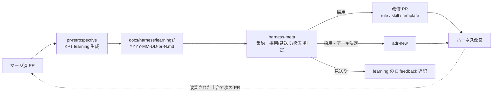

# Phase 2 — レトロスペクティブ & ハーネス改良ループ

## 目的 / スコープ

機能実装・ハーネス追加/修正の **Pull Request ごとに KPT（Keep / Problem / Try）レトロスペクティブ**を行い、得た学びを **ハーネス（rules / skills / templates / ADR）へ書き戻す自己改良ループ**を設置する。`pr-retrospective`（1 PR = 1 learning 生成）→ `harness-meta`（複数 learning 集約→採用判定→ハーネス改修）の二段構えを pokeform 規模で構築する。



**位置づけ（重要）**: 本フェーズは**ループの「仕掛け」を設置**するもの。実際に回り始めるのは MVP 実装で最初の PR が出てから（その時点で全ハーネスが揃っている）。そのため gh 権限（Phase 8）/ ADR（Phase 3）/ 型・カバレッジゲート（Phase 4）への**前方参照**を許容する（設置 ≠ 即時稼働）。

## 前提（依存）

- Phase 1（`docs/` 構造）。本フェーズで `docs/harness/` 配下と専用 rule/skill を新設する。
- 稼働時（実装 PR 以降）に Phase 3（ADR）/ Phase 4（型・カバレッジゲート）/ Phase 8（gh 権限）を利用する（設置時点では未完でも可）。

## 構成方針（採用 / 簡素化）

pokeform 規模に合わせ、KPT ループの中核のみ採用し重量級の自動化は簡素化／将来送りにする。

| 要素 | pokeform（本フェーズ）の方針 |
|---|---|
| PR 単位 KPT learning | 採用（`docs/harness/learnings/` に 1 PR = 1 ファイル・日本語 KPT） |
| 書き戻し | 採用（`harness-meta` + 簡素化した採用/見送り/撤去基準） |
| learning フォーマット SoT | 採用（`retrospective-format`・指標は pokeform ゲートに置換） |
| 改善提案プレフィックス | `[rule]`/`[skill]`/`[template]`/`[remove]` + `[adr]` |
| 指標 | 型 OK / カバレッジ% / Biome 違反 / CI / 差分行数（重量級メトリクスは不採用） |
| redaction | `redaction.md` 1 本（Secrets 中心 + 最小 PII） |
| 自動起動 | 不採用（将来送り）: 手動 or `finish-phase` 促し |
| dry-run | 簡素化: リスキー変更のみ軽量メモ（定量 dry-run は不採用） |
| batch 集約 | 採用（簡素）: `harness/learnings-batch-YYYY-WW` 週次/件数 PR |
| 外部研究駆動の改善 | 将来送り（対象外） |

## タスク

### A. ドキュメント基盤

- [ ] `docs/harness/README.md`: ループ全体図（PR → `pr-retrospective` → learning → `harness-meta` → 改修 PR / ADR）の説明。
- [ ] `docs/harness/learnings/INDEX.md`: learning 索引（PR番号 / タイトル / 生成日 / 関連 Plan）。
- [ ] `docs/harness/learnings/template.md`: learning 雛形（下記構造）。

### B. rules（paths スコープ付き）

- [ ] `.claude/rules/retrospective-format.md`（paths: `docs/harness/learnings/**`, 両 skill）: learning 構造の SoT。
- [ ] `.claude/rules/harness-meta-criteria.md`（paths: `.claude/skills/harness-meta/**`）: 採用/見送り/撤去 判定基準。
- [ ] `.claude/rules/redaction.md`（paths: `docs/harness/**`）: Secrets/PII の `[REDACTED-*]` 置換規約（token/key/メール/PAT/JWT 等の正規表現）。

### C. skills

> **クロスエージェント共有**: 両スキルとも skill-creator 準拠で `.claude/skills/<name>/` に canonical を作成し、`.agents/skills/<name>` を symlink して Codex と共有（`cross-agent.md`／Phase 6）。

- [ ] `.claude/skills/pr-retrospective/SKILL.md`（canonical・`allowed-tools: Bash(gh *) Bash(git *) Bash(pnpm *) Read Write Grep`）+ `.agents/skills/pr-retrospective` symlink。
- [ ] `.claude/skills/harness-meta/SKILL.md`（canonical・`allowed-tools: Bash(gh *) Bash(git *) Read Write Edit Grep`）+ `.agents/skills/harness-meta` symlink。

### D. PR テンプレート

- [ ] `.github/PULL_REQUEST_TEMPLATE/harness.md`: ハーネス改修 PR 用（採用根拠 / 対象 learning 欄）。
- [ ] 通常 PR テンプレに「ハーネス影響あり?」チェックを 1 行追加。

### E. 統合

- [ ] branch 命名 `harness/learnings-batch-YYYY-WW` / `harness/<purpose>`（必要なら `branch-naming.md` を Phase 6 rules に追加）。
- [ ] `finish-phase` skill（Phase 7）末尾に「PR merge 後に `pr-retrospective` を起動」促しを組み込む（本フェーズではメモのみ、実装は Phase 7）。
- [ ] ADR 連携: 🚀 Try のアーキ決定は `[adr]` → Phase 3 の `adr-new`。本ループ導入自体を ADR バックフィル（`00NN-kpt-retrospective-loop`）に追加（Phase 3 で起票）。
- [ ] CLAUDE.md にループ要約を追記（Phase 6 で反映）。

## learning ファイル構造（`retrospective-format.md` の SoT）

```markdown
---
id: learning-pr-NNN
title: PR #NNN レトロスペクティブ (<要約>)
type: learning
status: draft | reviewed | actioned
related_pr: NNN
related_plan: <phase/plan id> | —
generated_at: YYYY-MM-DDTHH:MM:SSZ
generator: pr-retrospective skill | 手動
---

> **要約(5行以内)**: 対象PR <url> / commit <sha> / merge <日時> / 差分 <files> files +<add>/-<del>

## ✅ Keep（継続したいこと）        … 最低3 / 推奨5-10
## ⚠️ Problem（詰まった点・制約）     … 同上
## 🚀 Try（次回の改善案）            … rule/skill/template/ADR 単位まで具体化
## 📊 指標
| 指標 | Before | After | Δ | 備考 |
|---|---|---|---|---|
| 型チェック | pass | pass | — | tsc --noEmit |
| カバレッジ | 100% | 100% | ±0 | Vitest |
| Biome 違反 | 0 | 0 | ±0 | biome check |
| 差分 files/行 | … | … | … | gh pr diff |
## 🤖 ハーネス改善提案   <!-- harness-meta が parse する正規構造 -->
- [ ] `[rule]` …
- [ ] `[skill]` …
- [ ] `[template]` …
- [ ] `[adr]` …        ← アーキ決定は ADR 化（Phase 3 の adr-new）
- [ ] `[remove]` …
## 📝 harness-meta フィードバック  <!-- 空でも見出し維持。meta が後追記 -->
### 採用 / ### 見送り / ### 保留 （3表 placeholder）
```

## `pr-retrospective` skill（1 PR 単位）

1. 入力: マージ済 PR 番号（未指定なら `gh pr list --state merged` で未処理を auto-detect）。
2. `gh pr view/diff/--comments` + `gh run view --log-failed`（CI 失敗時のみ）で diff/review/CI を収集。pokeform のゲート結果（型/カバレッジ/Biome）を 📊 指標へ。
3. KPT 分析（✅/⚠️/🚀、各最低 3）。
4. 🤖 改善提案を 5 プレフィックス + `[ ]` で起票。
5. **redaction**（`redaction.md` の正規表現で token/key/メール等を `[REDACTED-*]` 置換）。
6. `docs/harness/learnings/YYYY-MM-DD-pr-<n>.md` を生成 + `INDEX.md` 追記（同 PR 既存なら idempotent skip）。
7. `harness/learnings-batch-YYYY-WW` に commit/push、件数閾値（既定 10）or 週次で集約 PR を Draft 起票。**merge は人間 approve 後**（skill は merge しない）。PR コメントは出さず learning ファイルが SoT。

## `harness-meta` skill（複数 PR 集約 → 書き戻し）

1. `docs/harness/learnings/*.md` の `🤖 ハーネス改善提案`（未処理 `[ ]` のみ）を集約 parse（`[x]` 済は skip）。
2. `harness-meta-criteria.md` で **採用 / 見送り / 撤去** を判定。
3. リスキー変更（rule 全文書換 / skill 新規 / template 構造変更）は**軽量 dry-run メモ**（想定 before/after を記述し妥当性確認）を先行。
4. **採用** → `harness/<purpose>` で改修 PR（`[rule]`=rule 編集 / `[skill]`=SKILL.md 改修 / `[template]`=テンプレ編集 / `[adr]`=`adr-new` 起票）。**見送り** → 元 learning の `📝 feedback` に理由追記。**撤去** → 2 段階（status `removed` → cooldown → 物理削除）。
5. 採用提案を `[ ]`→`[x]` + 採用先 PR リンク。merge は人間 approve。

### `harness-meta-criteria.md`（簡素版）

- **採用**（いずれか）: ① 複数 PR(≥2) で反復 ② 明確な Problem 解消 ③ 既存 rule/ADR と直接対応 ④ コスト<効果 ⑤ 人間が採用明示。
- **見送り**（いずれか）: ① 後続フェーズ移行 ② 重複 ③ コスト過大で現状運用可 ④ 人間が見送り明示。
- **撤去**（全充足）: ① 一定期間（既定 3 ヶ月）未参照 ② dangling 参照ゼロ ③ 人間事前承認。**2 段階運用必須**（1 段階禁止）。

## 受け入れ基準

1. `docs/harness/`（`README.md` / `learnings/INDEX.md` / `learnings/template.md`）が存在。
2. rules `retrospective-format.md` / `harness-meta-criteria.md` / `redaction.md` が paths スコープ付きで存在。
3. skills `pr-retrospective` / `harness-meta` が呼び出せ、フローが定義済み。
4. `.github/PULL_REQUEST_TEMPLATE/harness.md` が存在し、通常 PR テンプレに「ハーネス影響」チェックがある。
5. `redaction.md` の正規表現で token/key/メール等が `[REDACTED-*]` 置換されることを 1 例で確認。

## 検証手順

1. テスト用のマージ済 PR に対し `pr-retrospective <PR#>` → KPT + 🤖改善提案 + 📝feedback placeholder 付き learning が生成され `INDEX.md` 追記。
2. その learning に `harness-meta` → 採用/見送り/撤去 分類、採用は改修 PR or `adr-new`、見送りは feedback 追記、`[ ]`→`[x]`（merge は人間 approve 待ちで停止）。
3. learning に PII/Secrets が `[REDACTED-*]` 置換、PR コメント未投稿（SoT は learning）を確認。

## スコープ外（将来送り）

- `pr-poller` 的 cron/閾値自動起動・orchestrator 連携。
- 三層メトリクス・3 軸定量 dry-run（golden-set / N≥10）。
- 外部研究駆動の `harness-evolution` skill。
- learning の機械検証 CI（frontmatter/プレフィックス検証）。

## 参考

- KPT レトロスペクティブ + `pr-retrospective` → `harness-meta` の二段構えによるハーネス自己改良ループ（pokeform 規模に簡素化して構築）。
