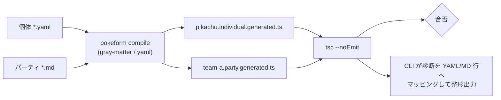
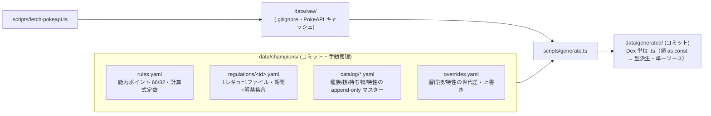

# pokeform — Pokemon as Code (ポケモンチャンピオンズ対応) 実装計画

## Context（なぜ作るか）

ポケモンチャンピオンズ（2026年4月リリースの対戦特化ポケモンゲーム）向けに、育成済みポケモンの**個体管理**と**パーティ構築支援**を TypeScript で行う "Pokemon as Code" な npm モジュールを新規作成する。狙いは、Claude Code / Codex などのコーディングエージェントが pnpm コマンドで個体・パーティの整合性を機械的に検証しながら構築をブラッシュアップできる土台を提供すること。

- リポジトリ `/Users/subroh_0508/pokeform` は空（グリーンフィールド、git 初期化済み・main ブランチ）。
- **MVP のゴール**: パーティ構築の一貫性チェック（防御弱点の集中検出）と技範囲チェックを提供する。
- **将来**: ステータス調整（耐久ライン逆算等）の壁打ち。

### 確定しているゲーム仕様（WebSearch で確認済み）

- **レベル50固定・個体値31固定**。
- **能力ポイント制（努力値廃止）**: 合計 **66**、1能力あたり最大 **32**。
- **HP実数値** = `floor((種族値×2 + 31 + 能力ポイント×2) × 50/100 + 60)`
- **HP以外** = `floor( floor((種族値×2 + 31 + 能力ポイント×2) × 50/100 + 5) × 性格補正 )`（二重 floor に注意）
- **性格補正** = ×0.9 / 1.0 / 1.1（上げ能力・下げ能力を自由選択。同一能力に両補正は不可）。
- **現行レギュレーション（M系）**: メガシンカ可、テラスタル/ダイマックス不可。

### 確定した設計方針（ユーザー合意済み）

1. **型チェックは「tsc のみ」で行う（Zod 等の実行時バリデーションは採用しない）**。YAML/Markdown を codegen で `.generated.ts` に変換し、`tsc --noEmit` を唯一の検証ゲートにする。
2. **Linter = Biome**（formatter 一体・設定 1ファイル）。
3. **PokeAPI データは vendor 方式**（ビルド時取得→整形→`data/generated/` をコミット）。**MVP 時点で全国図鑑の全種族分を生成**しておく（オフライン・決定論的・CI 高速）。
4. **テストカバレッジ閾値は最初から 100%**（lines/branches/functions/statements すべて 100）。コーディングエージェントによる実装前提のため、最初から最高基準を強制する。
5. **レビューは機械ゲートと意味的レビューの二層**。型/カバレッジ/Biome は Git hooks + CI の機械ゲートで強制し、その上に **PR マージ前の意味的レビュー**を `code-review`（ソース用）/ `harness-review`（ハーネス資産用）の 2 skill で重ねる（観点が本質的に異なるため分割）。機械ゲート緑 ＋ レビュー承認で auto-merge する。詳細はハーネス計画 [00-harness-setup Phase 3](../00-harness-setup/phase-03-code-review.md) / ADR `0017-semantic-code-review-skills`。

---

## アーキテクチャ

### 検証の単一ゲート: YAML/MD → codegen → tsc



- codegen は常に成功してファイルを吐く。**不正は tsc が型エラーとして検出**する（要求「TS の型チェック機能で弾く」を文字通り充足）。
- 生成 TS には `// @source pikachu.yaml:12` コメントを埋め、CLI が `tsc` の診断位置を元の YAML/MD 行へ逆引きして人間/エージェント向けに整形（Zod 不採用でも明快な診断を担保）。
- エラー型はブランド型名で可読化: `MoveNotLearnedBy<"pikachu","surf">` / `AbilityNotAvailable<...>` / `DuplicateSpeciesInParty<...>` / `NotLegalInRegulation<...>` / `PointTotalMustBe66<70>`。

### 種族の型表現（1000+ 種スケール）

「**種族値が一意に定まる粒度 = 1種族**」を `SpeciesId`（kebab-case の安定キー）とする。フォルム/リージョン/メガで種族値が変わるものは別 `SpeciesId`（例 `charizard`, `charizard-mega-x`, `rotom-wash`, `tauros-paldea-aqua`）。

巨大 union の分配コストを避けるため、**`SpeciesDex[S]` のプロパティアクセス主体**で制約する。

> **実装上の materialize（Phase 1 で確定）**: 以下の `interface SpeciesDex { ... }` / `interface MoveDex { ... }` 等のコード例は**型の形（shape）の図示**であり、生成物の実ファイル構成ではない。`data/generated/<dex>.ts` は値 `export const xxxDex = { ... } as const` を出力し、そこから **`type XxxDex = typeof xxxDex` / `type XxxId = keyof XxxDex` を派生**して**値と型を単一ソース化**する（型と値を別ファイルに二重管理しない）。親型 `XxxBase` への適合は `satisfies`（acyclic な types/moves/abilities）または `Assignable<Record<string, XxxBase>, XxxDex>`（`megaEvolvesTo`/`megaStoneFor` が派生 `SpeciesId` を自己参照する species/items）で検証する。詳細は [[type-conventions]] / [[data-pipeline]]。

**英名/日本語名の両対応**: 種族名・タイプ・技・特性・持ち物はすべて**英名（kebab-case の安定 ID = 型キー）と日本語名の対応を型として持つ**。ID を型キーに使うのは安定性（PokeAPI 由来・改名されにくい・union キーに適する）のため。日本語名は ① 各エントリの `name` プロパティ ② 名前変換マップ型 `JaName<Id>` / `IdByJaName<"ピカチュウ">` の双方向リテラル型で引けるようにし、YAML を日本語名でも英名でも記述できるようにする（codegen が解決）。

```ts
// data/generated/names.ts （生成）— 双方向の名称マップ
export type SpeciesName   = { en: "Pikachu"; ja: "ピカチュウ" } /* | ... 各種族 */;
export type TypeName      = { electric: { en: "Electric"; ja: "でんき" } /* | ... 18種 */ };
export type MoveName      = { "volt-tackle": { en: "Volt Tackle"; ja: "ボルテッカー" } /* ... */ };
export type AbilityName   = { static: { en: "Static"; ja: "せいでんき" } /* ... */ };
export type ItemName      = { "light-ball": { en: "Light Ball"; ja: "でんきだま" } /* ... */ };
// 逆引き（日本語名→ID）も生成: type SpeciesIdByJa<"ピカチュウ"> = "pikachu"

// src/types/species.ts — 親型（技の MoveBase と同じスタイル）
export interface SpeciesBase {
  dex: number;
  id: string;
  name: { en: string; ja: string };
  types: readonly PokemonType[];                 // TypeDex のキー（1〜2）
  baseStats: { hp: number; attack: number; defense: number; spAttack: number; spDefense: number; speed: number };
  abilities: readonly AbilityId[];               // AbilityDex のキー
  moves: readonly MoveId[];                       // MoveDex のキー
  items: "any" | readonly ItemId[];              // ItemDex のキー、または "any"
  megaEvolvesTo?: SpeciesId;
  // 解禁レギュレーションは種族側に持たない。per-regulation（regulationDex[R].species）が正本（A案・ADR 0021）。
}

// data/generated/species.ts — 各種族を子型として specialize し SpeciesDex に集約（生成）
export interface SpeciesDex {
  pikachu: SpeciesBase & {
    dex: 25; id: "pikachu";
    name: { en: "Pikachu"; ja: "ピカチュウ" };
    types: readonly ["electric"];
    baseStats: { hp:35; attack:55; defense:40; spAttack:50; spDefense:50; speed:90 };
    abilities: readonly ["static","lightning-rod"];
    moves: readonly ["volt-tackle","thunderbolt","iron-tail","quick-attack", /* ... */];
    items: "any";
  };
  "charizard-mega-x": SpeciesBase & {
    dex: 6; id: "charizard-mega-x";
    name: { en: "Mega Charizard X"; ja: "メガリザードンX" };
    types: readonly ["fire","dragon"];
    baseStats: { hp:78; attack:130; defense:111; spAttack:130; spDefense:85; speed:100 };
    abilities: readonly ["tough-claws"];
    moves: readonly ["flare-blitz","dragon-claw", /* ... */];
    items: "any";
  };
  // ... 全種族
}
export type SpeciesId = keyof SpeciesDex;   // 技の MoveId = keyof MoveDex と同じ導出
```

日本語名は生成段で自動付与し、CLI 出力（`analyze:coverage` の表など）も日本語名で表示する。

> **更新（02-data-model-redesign Phase 10 / ADR 0025）**: 名前の SoT は PokeAPI ではなく **`data/champions/catalog/*.yaml`（`id → { ja, en }`・手書き）** へ移行した。`generate.ts` は名前 / タイプ相性について PokeAPI を読まず YAML を変換する。また **abilities / items の生成 dex は `name` を持たない**（id のみ + items は `category?`/`megaStoneFor?`。名前は catalog YAML と `names.ts` 逆引きが持つ）。本節以下の `AbilityBase`/`ItemBase` の `name` を含む例は MVP 当時のもので、現行は [[type-conventions]] / [[data-pipeline]] を正本とする。

#### 技の型: 親型 `MoveBase` + 技ごとの子型（`MoveDex` で ID キー集約）

技は**1つの親型を定義し、各技を子型として specialize する**スタイルを採用する。巨大 union（`VoltTackle | … 1000+`）は tsc の分配コストが重いため、子型は **ID をキーにした `MoveDex` インターフェースに集約**して `MoveDex[Id]` でルックアップする（`SpeciesDex` と同じ方針）。

```ts
// src/types/move.ts — 親型
export interface MoveBase {
  id: string;
  name: { en: string; ja: string };
  type: PokemonType;
  damageClass: "physical" | "special" | "status";
  power: number | null;       // 変化技は null
  accuracy: number | null;
  pp: number;
  priority: number;
}

// data/generated/moves.ts — 各技を子型として specialize し MoveDex に集約（生成）
export interface MoveDex {
  "volt-tackle": MoveBase & {
    id: "volt-tackle"; name: { en: "Volt Tackle"; ja: "ボルテッカー" };
    type: "electric"; damageClass: "physical"; power: 120; accuracy: 100; pp: 15; priority: 0;
  };
  "iron-tail": MoveBase & {
    id: "iron-tail"; name: { en: "Iron Tail"; ja: "アイアンテール" };
    type: "steel"; damageClass: "physical"; power: 100; accuracy: 75; pp: 15; priority: 0;
  };
  // ... 全技
}
export type MoveId = keyof MoveDex;
```

- **整合（ID 単一ソース）**: 個体の技正当性は `SpeciesDex[S]["moves"][number]`（ID の union）で型チェック、技の詳細（type/damageClass 等）は `MoveDex[Id]` で参照。種族の `moves` 配列は ID 参照のままで二重管理を避ける（codegen が両者を同一データから出力）。
- `analyze:coverage` は `MoveDex[move].type` / `.damageClass` を型安全に読んで攻撃範囲・弱点を算出する。

#### タイプ・特性・持ち物も同一スタイルに統一

タイプ・特性・持ち物も**技と完全に同じパターン**（親型 `XxxBase` + エントリごとの子型 + `XxxDex` で ID キー集約 + `XxxId = keyof XxxDex`）で定義する。すべて英名 ID をキー、日本語名を `name` プロパティで持つ。

```ts
// src/types/type-chart.ts — タイプ
export interface TypeBase {
  id: string;
  name: { en: string; ja: string };
  // 攻撃時の対被攻撃タイプ倍率（防御タイプ ID → 0|0.5|1|2）。複合は積で算出
  damageTo: Record<string, 0 | 0.5 | 1 | 2>;
}
// data/generated/types.ts（生成）
export interface TypeDex {
  electric: TypeBase & {
    id: "electric"; name: { en: "Electric"; ja: "でんき" };
    damageTo: { water: 2; flying: 2; ground: 0; grass: 0.5; dragon: 0.5; electric: 0.5; /* ... */ };
  };
  // ... 18タイプ
}
export type PokemonType = keyof TypeDex;   // 既存の PokemonType union はこれに統一

// src/types/ability.ts + data/generated/abilities.ts
export interface AbilityBase { id: string; name: { en: string; ja: string }; }
export interface AbilityDex {
  static: AbilityBase & { id: "static"; name: { en: "Static"; ja: "せいでんき" } };
  // ... 全特性
}
export type AbilityId = keyof AbilityDex;

// src/types/item.ts + data/generated/items.ts
export interface ItemBase {
  id: string; name: { en: string; ja: string };
  category?: string;                 // メガストーン等の分類
  megaStoneFor?: SpeciesId;          // メガストーンならメガ先種族
}
export interface ItemDex {
  "light-ball": ItemBase & { id: "light-ball"; name: { en: "Light Ball"; ja: "でんきだま" } };
  "charizardite-x": ItemBase & {
    id: "charizardite-x"; name: { en: "Charizardite X"; ja: "リザードナイトX" };
    category: "mega-stone"; megaStoneFor: "charizard";
  };
  // ... 全持ち物
}
export type ItemId = keyof ItemDex;
```

これにより、`SpeciesDex` 内の `types` / `abilities` / `moves` / `items` はすべて対応する `Dex` のキー（ID）参照に統一され、詳細（日本語名・倍率・分類）は各 `Dex[Id]` ルックアップで型安全に取得できる。親型は構造的に共通なので、汎用ヘルパ（`name(id)` 解決、逆引き `IdByJaName`）も4種で共通化する。

個体型は種族ジェネリックで制約（**型シグネチャの核心**）:

```ts
// src/types/individual.ts
export interface IndividualSpec<S extends SpeciesId> {
  nature: { up: StatKey; down: Exclude<StatKey, /* up と同一不可 */ StatKey> };
  ability: SpeciesDex[S]["abilities"][number];          // 使えない特性→型エラー
  item: ItemConstraint<SpeciesDex[S]>;
  points: PointAllocation;                              // 各 0..32 のリテラル union
  moves: ReadonlyArray<SpeciesDex[S]["moves"][number]>; // 覚えない技→型エラー
}
export function defineIndividual<S extends SpeciesId>(species: S, spec: IndividualSpec<S>): Individual<S>;
```

- **per-stat ≤32**: 生成した `type PointValue = 0|1|…|32`。
- **合計66**: codegen が各個体の合計を算出し、生成 TS に `satisfies PointTotalMustBe66<computedSum>` を埋める。型レベルで `computedSum extends 66` を検証（型レベル算術の重さを codegen 側に逃がす）。
- **パーティ**: メンバーをタプルで生成し、`UniqueSpecies<T>`（同種族重複）, タプル長 ≤6, `NotLegalInRegulation<S,R>`（メンバー base 種族 `S` がパーティ宣言レギュ `R` の解禁集合 `regulationDex[R].species` に含まれるか）を型制約（A案・ADR 0021）。

### 実装値の自動計算

`defineIndividual` 内（インスタンス生成時）で実数値を算出し `Individual.realStats` に格納（要求「実装値は自動計算」を充足）。計算は純関数 `src/domain/calc-stats.ts`。

### データ生成パイプライン（vendor）



> `data/champions/*.yaml` は PokeAPI に無い情報（能力ポイント・解禁レギュ等）の唯一のソース。`generate.ts` が raw と champions を合成して `data/generated/` を出力する。

PokeAPI→要求項目の対応:

| 要求項目 | PokeAPI ソース |
|---|---|
| 全国図鑑番号・種族名 | `pokemon-species`, `pokemon.id` |
| フォルム/リージョン/メガ | `pokemon-form`, variety 群 |
| 種族値 | `pokemon.stats[].base_stat` |
| 覚える技 | `pokemon.moves[]`（version_group で世代を絞り、`overrides.yaml` で補正） |
| タイプ | `pokemon.types[]` |
| 特性 | `pokemon.abilities[]`（隠れ特性可否は champions 側フラグ） |
| 持ち物 | `item` エンドポイント（メガストーン含む） |
| **レギュレーション解禁** | **PokeAPI に無し → `data/champions/regulations/<id>.yaml`（per-reg 一本化・ADR 0021）** |

---

## ディレクトリ構成

```
pokeform/
├─ package.json                 # type:module, bin:{pokeform}, pnpm, scripts
├─ tsconfig.json                # ライブラリ本体
├─ tsconfig.generated.json      # 生成 *.generated.ts 検証専用（strict）
├─ biome.json
├─ vitest.config.ts
├─ src/
│  ├─ index.ts                  # 公開API: defineIndividual / defineParty / 型
│  ├─ types/
│  │  ├─ stats.ts               # StatKey, BaseStats, RealStats, PointAllocation, PointValue
│  │  ├─ type-chart.ts          # PokemonType union, 相性表型
│  │  ├─ move.ts / ability.ts / item.ts / nature.ts
│  │  ├─ species.ts             # 生成 SpeciesId/SpeciesDex の re-export
│  │  ├─ individual.ts          # IndividualSpec<S>, Individual, ブランドエラー型
│  │  └─ party.ts               # PartySpec, Party, UniqueSpecies/NotLegal 制約
│  ├─ domain/                   # 各 .ts と同階層に <name>.test.ts をコロケーション
│  │  ├─ calc-stats.ts / calc-stats.test.ts          # 実数値計算（二重 floor）。テスト最重要
│  │  ├─ type-effectiveness.ts / type-effectiveness.test.ts  # 単/複合タイプ倍率
│  │  ├─ coverage.ts / coverage.test.ts              # 技範囲・弱点集計（MVP の価値の核）
│  │  ├─ legality.ts / legality.test.ts              # （型で表現しきれない補助ルールがあれば）
│  │  └─ __fixtures__/          # 共有 fixture（既知個体・パーティ）をテスト近傍に配置
│  ├─ io/
│  │  ├─ load-individual.ts     # yaml パース（コメント保持）
│  │  ├─ load-party.ts          # gray-matter で frontmatter + 本文
│  │  └─ resolve-paths.ts       # ディレクトリ再帰 glob（tinyglobby）
│  ├─ codegen/
│  │  ├─ emit-individual-ts.ts  # YAML → *.individual.generated.ts
│  │  ├─ emit-party-ts.ts       # MD  → *.party.generated.ts
│  │  └─ run-tsc.ts             # tsc 実行 + 診断を source 行へマッピング
│  └─ cli/
│     ├─ index.ts               # cac ルーティング
│     └─ commands/              # check-individual / check-party / analyze-coverage / compile / typecheck / stat
├─ scripts/
│  ├─ fetch-pokeapi.ts
│  └─ generate.ts
├─ data/
│  ├─ raw/                      # .gitignore
│  ├─ champions/                # コミット: rules.yaml / regulations/<id>.yaml / overrides.yaml / catalog/{species,moves,items,abilities}.yaml
│  └─ generated/               # コミット: Dex 単位 .ts（types/moves/abilities/items/species/names + regulations/<id>.ts+index・値 as const → 型派生）
└─ team/                        # サンプル兼ユーザー置き場
   ├─ individuals/*.yaml
   └─ parties/*.md
```

> **テスト配置**: 専用 `tests/` ディレクトリは作らず、**プロダクションコードと同じ場所に `<name>.test.ts` をコロケーション**する（例: `src/domain/calc-stats.ts` ↔ `src/domain/calc-stats.test.ts`）。共有 fixture は近傍の `__fixtures__/` に置く。`vitest.config.ts` の `include` は `src/**/*.test.ts`、`coverage.exclude` に `**/*.test.ts` / `**/__fixtures__/**` を指定。

### 入力フォーマット例（言語はファイル単位で宣言）

YAML は**ファイル先頭の `lang: ja|en` 宣言で記述言語を1ファイル単位で固定**する（未指定時の既定は `ja`）。loader/codegen は宣言言語に従って全名称フィールド（species / ability / item / moves / nature / points のキー）を解決し、生成済みの双方向名称マップ（`IdByJaName` / `IdByEnName`）で**正規の ID へ正規化**してから型生成・検証する。

- **厳格化**: 宣言言語に一致しない名称（例 `lang: ja` なのに `species: pikachu`）は「日本語名で記述してください」とエラー。フィールド混在を許さないことで曖昧さを排除し、エージェントにとって予測可能にする。
- 未知の名称は「不明な技『○○』」と行番号付きで報告。
- パーティ Markdown も frontmatter に `lang:` を持てる（本文フリーテキストは言語自由）。
- CLI 出力（エラー・`analyze:coverage` の表）の表示言語は別途 `--lang ja|en` で指定（既定 `ja`、入力ファイルの `lang` とは独立）。

個体（日本語ファイル）`team/individuals/pikachu.yaml`:
```yaml
lang: ja
# でんき統一の先発。すばやさ全振りで上から削る意図（ようき相当）
species: ピカチュウ
nature: { up: すばやさ, down: ぼうぎょ }
ability: せいでんき
item: でんきだま
points: { HP: 0, こうげき: 32, ぼうぎょ: 0, とくこう: 0, とくぼう: 2, すばやさ: 32 }
moves: [ボルテッカー, アイアンテール, でんこうせっか, 10まんボルト]
```

個体（英語ファイル）`team/individuals/garchomp.yaml`:
```yaml
lang: en
species: garchomp
nature: { up: speed, down: spAttack }
ability: rough-skin
item: choice-scarf
points: { hp: 0, attack: 32, defense: 2, spAttack: 0, spDefense: 0, speed: 32 }
moves: [earthquake, dragon-claw, stone-edge, swords-dance]
```

パーティ `team/parties/standard.md`:
```markdown
---
party: でんき軸スタンダード
regulation: champions-m-a
members:
  - ../individuals/pikachu.yaml
  - ../individuals/garchomp.yaml
---
ピカチュウ先発でライボルト撒き…（構築意図フリーテキスト）
```

---

## CLI コマンド体系

全コマンドはファイルパス or ディレクトリ（再帰 glob）を受け取る。CLI は `cac`。

| コマンド | 責務 | フェーズ |
|---|---|---|
| `pokeform analyze:coverage <path>` | パーティの技範囲・防御弱点分析（各タイプに何匹弱点/半減か）。閾値超過で非0終了 | **MVP** |
| `pokeform check:party <path>` | パーティ整合: 参照切れ・同種族重複・未解禁混入・6体超過。codegen→tsc | **MVP**（一貫性部分） |
| `pokeform check:individual <path>` | 個体整合: 覚えない技・使えない特性・存在しないフォルム・性格 up=down・ポイント 66/32。codegen→tsc | Phase 2 |
| `pokeform compile <path>` | YAML/MD → `*.generated.ts` 出力（検証の前処理） | Phase 2 |
| `pokeform typecheck <path>` | compile → `tsc -p tsconfig.generated.json --noEmit` → 診断整形 | Phase 2 |
| `pokeform stat <path>` | 個体の実数値・性格補正・ポイント配分・耐久指数を表示（壁打ち補助・`--lang`） | **Phase 3** |

`package.json` scripts に `check:party` / `check:individual` / `analyze:coverage` / `typecheck` / `generate:data` を割り当て。

### 分析アルゴリズム（domain/coverage.ts, MVP の核）

- **タイプ相性表**: 第9世代準拠の静的定数（攻撃→防御の基本倍率 `0|0.5|1|2`、複合タイプは積）。テラス不可で変動要素が少なくシンプル。
- **攻撃範囲**: 各個体の攻撃技（`damage_class != status`）からタイプ集合を抽出 → 18 防御タイプ中、等倍超を出せない「穴」を列挙。
- **防御弱点**: 各攻撃タイプ A について `weakCount = #{個体 | 倍率≥2}`, `resistCount = #{個体 | 倍率≤0.5}`。`weakCount ≥ 3` を脆弱警告として終了コードへ反映。メガ持ち個体は `megaEvolvesTo` 先のタイプでも追加分析。

---

## 実装フェーズ

- **Phase 0 — 足場**: pnpm init / tsconfig 2種 / biome / vitest / cac。`src/types/stats.ts`・`type-chart.ts` 静的型。`domain/calc-stats.ts` + テスト（後述の検証式を実装）。
- **Phase 1 — データ生成 + MVP**: `scripts/fetch-pokeapi.ts` + `generate.ts` で `data/generated/` の Dex 群を生成（MVP は代表種サブセット + 全 18 タイプ。`catalog/*.yaml` を広げれば全種族へ拡張可）。`io/load-party.ts` + `resolve-paths.ts`。`domain/coverage.ts` + `type-effectiveness.ts`。CLI `analyze:coverage`、`check:party`（参照解決・重複・未解禁・体数 = 一貫性チェック）。→ **要求 MVP 達成**。
- **Phase 2 — 個体 tsc 検証層**: `codegen/emit-individual-ts.ts` / `emit-party-ts.ts` / `run-tsc.ts`。`tsconfig.generated.json`。ジェネリック種族制約 `SpeciesDex[S]` の本格運用。`check:individual` / `compile` / `typecheck`。ブランドエラー型で診断可読化。
- **Phase 3 — ステータス調整の壁打ち**: `pokeform stat`（実数値・性格補正・ポイント配分・耐久指数表示）、耐久/火力指数（`domain/stat-indices.ts`）、ダメージ式（`domain/damage.ts`・確定数判定の範囲）、ポイント逆算（`domain/stat-tuning.ts`・「○○の××を確定耐え」「素早さ□□抜き」→ 合計66/各≤32 で解探索・実現不能は報告）と調整提案。耐久/火力指数・ダメージ式・逆算の定義は [[game-spec]] を参照。本格ダメージ計算（乱数16段の確定数表・急所・補正）は将来計画 `02-<slug>` へ。

---

## 主要トレードオフ

1. **tsc のみ検証（Zod 不採用）**: 構造制約（技/特性/フォルム/性格/重複/レギュ）は型で自然に弾ける。合計66 のみ型レベル算術が重いため、codegen が合計を算出し型注釈に埋める方式で逃がす。診断可読性は ① ブランドエラー型名 ② 生成 TS の `@source` コメント→YAML 行マッピングで担保。
2. **生成データのコミット（vendor）**: リポジトリは肥大化するが、オフライン・決定論性・CI 速度を優先。`data/raw` のみ gitignore。
3. **巨大 `SpeciesId` union**: tsc 性能懸念があるため `SpeciesDex[S]` のプロパティアクセス主体で union 分配を回避。問題化したらモジュール分割で対応。
4. **メガの二重表現**: 個体は素種族で定義（直感性）、`megaEvolvesTo` リンクでメガ後種族値/タイプを分析参照（正確さ）。整合は overrides で管理。

---

## 検証方法（end-to-end）

1. **計算式テスト（Vitest）**: 既知個体の実数値を fixture 化し `calc-stats.ts` を照合。特に**性格補正の二重 floor 境界**（端数が出る種族値×ポイント）と、ポイント 0/32 境界を重点。`pnpm test`。
   - **カバレッジ閾値 100%**: `vitest.config.ts` の `coverage.thresholds` を `{ lines:100, branches:100, functions:100, statements:100 }` に設定し、`pnpm test --coverage`（および CI）で 100% 未満は失敗させる。codegen / CLI 配線など本質的にテスト困難な薄い層は `coverage.exclude` で明示除外し、ドメインロジック（calc-stats / type-effectiveness / coverage / legality）は完全網羅する。
2. **タイプ相性テスト**: 18×18 の代表セル + 複合タイプ（×4 / ×0.25 / ×0）を検証。
3. **MVP 動作確認**: サンプル `team/` を用意し
   - `pnpm pokeform analyze:coverage team/parties/standard.md` → 弱点集中（例 Fire 弱点3体）と技範囲の穴が表で出ること、脆弱時に非0終了すること。
   - `pnpm pokeform check:party team/parties/` （ディレクトリ再帰）→ 同種族重複・未解禁・参照切れを検出すること。
4. **個体 tsc 検証（Phase 2）**: わざと覚えない技を含む YAML を置き、`pnpm pokeform check:individual` が `MoveNotLearnedBy<...>` を YAML 行付きで報告し非0終了すること。正常個体では 0 終了すること。
5. **Lint**: `pnpm biome check .` が通ること。

## 参考ソース（リサーチ）

- ポケモン徹底攻略「SVからの変更点」 https://yakkun.com/ch/changes.htm
- 能力ポイント仕様 https://yakkun.com/ch/stat_points.htm ／ Gamerch https://gamerch.com/pokemonchampions/970094
- Pokemon Champions No IVs guide https://genpkm.com/blog/pokemon-champions-no-ivs-stat-points-competitive-guide-2026
- 対戦フォーマット（Game8） https://game8.co/games/Pokemon-Champions/archives/588873
- レギュレーション M-A https://gamerch.com/pokemonchampions/971116
