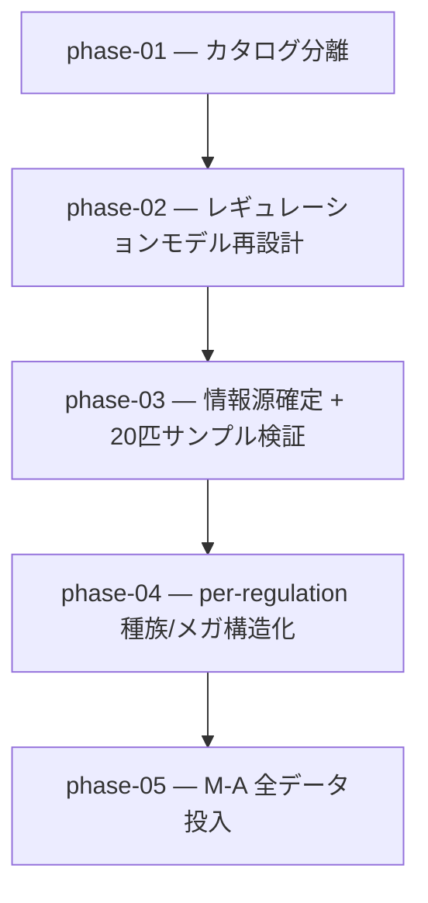

# 02-data-model-redesign — ポケモンデータ保持モデルの再設計（実装計画インデックス）

ポケモンチャンピオンズの**レギュレーションごとに変化する解禁情報**（種族・技・持ち物・メガシンカ）を
正しく保持できるよう、データ保持モデルを再設計する計画群。入力 YAML の構造（カタログ分離 / per-regulation 化）と
生成 TS 型（per-reg 型・解禁判定の正本一本化）を作り直し、最後にレギュレーション M-A の解禁データを
信頼できる情報源から全量投入する。設計の正本は [`OVERVIEW.md`](./OVERVIEW.md)、規約は
[`.claude/rules/data-pipeline.md`](../../../.claude/rules/data-pipeline.md) / [`type-conventions.md`](../../../.claude/rules/type-conventions.md)。

## ゴール / アウトカム

レギュレーション（期間付き・終了 nullable）ごとに解禁される種族・技・持ち物・メガを per-regulation YAML で
保持し、種族・持ち物・メガは per-reg TS 型として生成・型レベル解禁判定の正本になる。M-A の全解禁データが揃う。
詳細は [`OVERVIEW.md`](./OVERVIEW.md) を参照。

## フェーズ依存グラフ

## フェーズ一覧（この順で実施）

- [x] [Phase 1 — カタログ分離（種族 / 技 / 持ち物 / 特性の append-only マスター）](./phase-01-catalog-split.md)
- [x] [Phase 2 — レギュレーションモデル再設計（per-reg YAML + period + per-reg 型 + A案型機構）](./phase-02-regulation-model.md)
- [x] [Phase 3 — 情報源確定 + 20匹サンプル検証](./phase-03-source-and-sample.md)
- [ ] [Phase 4 — per-regulation 種族/メガ構造化（global species.ts 廃止 → per-reg species.ts 正本 + 派生統合 view）](./phase-04-per-regulation-species.md)
- [ ] [Phase 5 — M-A 全データ投入](./phase-05-ma-full-data.md)

## この計画群全体の受け入れ基準

1. 各フェーズ末で `pnpm verify`（型 / カバレッジ100% / Biome）が緑。
2. レギュレーションが期間（開始必須・終了 nullable）付きで管理され TS 型として参照できる。
3. 種族 / 技 / 持ち物 / 特性が独立カタログ YAML（append-only）で管理され、種族はその id を参照する。
4. 解禁情報の正本が per-regulation に一本化され（`SpeciesBase.regulations[]` 廃止）、型レベル解禁判定が
   per-reg 解禁集合を参照する。
5. レギュレーション M-A の解禁種族・技・持ち物・メガが信頼できる情報源に基づき全量そろう。

## 補足

- 各 phase doc は `docs/plan/README.md` の Phase doc 共通テンプレートに従う。
- スキル作成は `skill-creator`、ADR は `adr-new`（[[skill-authoring]] / [[adr]]）。Phase 2 はデータ保持モデルの
  アーキ決定（解禁判定正本の一本化 / カタログ分離 / period）として ADR を起票する（ADR 0012 / 0014 を踏まえる）。
- 既存 `00` / `01` の遡及改修はしない。
