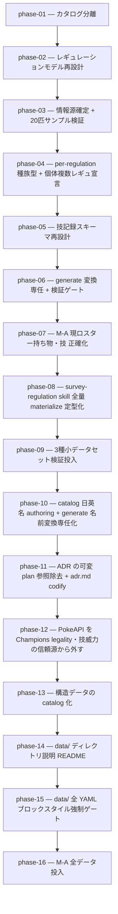

# 02-data-model-redesign — ポケモンデータ保持モデルの再設計（実装計画インデックス）

ポケモンチャンピオンズの**レギュレーションごとに変化する解禁情報**（種族・技・持ち物・メガシンカ）を
正しく保持できるよう、データ保持モデルを再設計する計画群。入力 YAML の構造（カタログ分離 / per-regulation 化）と
生成 TS 型（per-reg 型・解禁判定の正本一本化）を作り直し、最後にレギュレーション M-A の解禁データを
信頼できる情報源から全量投入する。設計の正本は [`OVERVIEW.md`](./OVERVIEW.md)、規約は
[`.claude/rules/data-pipeline.md`](../../../.claude/rules/data-pipeline.md) / [`type-conventions.md`](../../../.claude/rules/type-conventions.md)。

> 設計の正本は [`OVERVIEW.md`](./OVERVIEW.md)（ゴール / 背景 / 設計方針 / 実装指針 / スコープ外 /
> 計画群全体の受け入れ基準）。本 README は薄索引（導入 + OVERVIEW ポインタ + 依存グラフ + phase 一覧）。

## フェーズ依存グラフ

## フェーズ一覧（この順で実施）

- [x] [Phase 1 — カタログ分離（種族 / 技 / 持ち物 / 特性の append-only マスター）](./phase-01-catalog-split.md)
- [x] [Phase 2 — レギュレーションモデル再設計（per-reg YAML + period + per-reg 型 + A案型機構）](./phase-02-regulation-model.md)
- [x] [Phase 3 — 情報源確定 + 20匹サンプル検証](./phase-03-source-and-sample.md)
- [x] [Phase 4 — per-regulation 種族型 + 個体の複数レギュレーション宣言（global species.ts 廃止 → per-reg species.ts 正本・per-reg 習得技 + reg-aware 型機構 + 個体 regulations:[] fan-out）](./phase-04-per-regulation-species.md)
- [x] [Phase 5 — 技記録スキーマ再設計（種族キー = 解禁 + per-species moves/mega[]・block 記法・generate 読取り追従・ADR 0022）](./phase-05-move-recording-schema.md)
- [x] [Phase 6 — generate.ts を変換専任へ縮小 + authoring 検証ゲート check:regulation 新設（ADR 0023）](./phase-06-generator-and-validation.md)
- [x] [Phase 7 — M-A 現ロスター持ち物・技 正確化（interim・現ロスター26種限定）](./phase-07-ma-roster-accuracy.md)
- [x] [Phase 8 — `survey-regulation` skill の全量 materialize 手順を定型化（harness・Serebii 第一優先）](./phase-08-survey-skill-fullset.md)
- [x] [Phase 9 — 小データセット検証投入（garchomp / charizard / gengar の 3 種・パイプライン本格スケール de-risk）](./phase-09-smoke-three-species.md)
- [x] [Phase 10 — catalog 日英名 authoring + generate 名前変換専任化（catalog `id → { ja, en }`・名前 SoT を YAML へ・types は名前+相性も YAML・abilities/items 生成 TS を id-only 化）](./phase-10-catalog-name-authoring.md)
- [x] [Phase 11 — ADR の可変 plan 参照を除去 + adr.md へ方針 codify（harness hygiene）](./phase-11-adr-plan-hygiene.md)
- [x] [Phase 12 — PokeAPI を Champions レギュレーション情報・技威力の信頼源から外す（決定 + ADR + harness 追従 + 検証）](./phase-12-pokeapi-exclusion.md)
- [x] [Phase 13 — 構造データの catalog 化（種族値/タイプ/特性/図鑑番号/category を YAML SoT へ・materialize 新設・generate raw 非依存・overrides 廃止）](./phase-13-structural-data-catalog.md)
- [x] [Phase 14 — data/ ディレクトリ説明 README（ポインタ式・何を表す / 取得元 / SoT / 取得・更新 skill を索引化）](./phase-14-data-directory-readme.md)
- [x] [Phase 15 — data/ 全 YAML にブロックスタイルを強制する CI ゲート新設（materialize block 出力・既存再整形・flow 禁止）](./phase-15-yaml-block-style-gate.md)
- [ ] [Phase 16 — M-A 全データ投入（全186種 + 全 movepool）](./phase-16-ma-full-data.md)

> 計画群全体の受け入れ基準は [`OVERVIEW.md` の「受け入れ基準」節](./OVERVIEW.md#受け入れ基準) を参照。

## 補足

- 各 phase doc は [`plan-templates.md`](../../../.claude/skills/plans-new/references/plan-templates.md) の
  「phase-NN-<slug>.md」節（テンプレ正本）に従う。
- スキル作成は `skill-creator`、ADR は `adr-new`（[[skill-authoring]] / [[adr]]）。Phase 2 はデータ保持モデルの
  アーキ決定（解禁判定正本の一本化 / カタログ分離 / period）として ADR を起票する（ADR 0012 / 0014 を踏まえる）。
