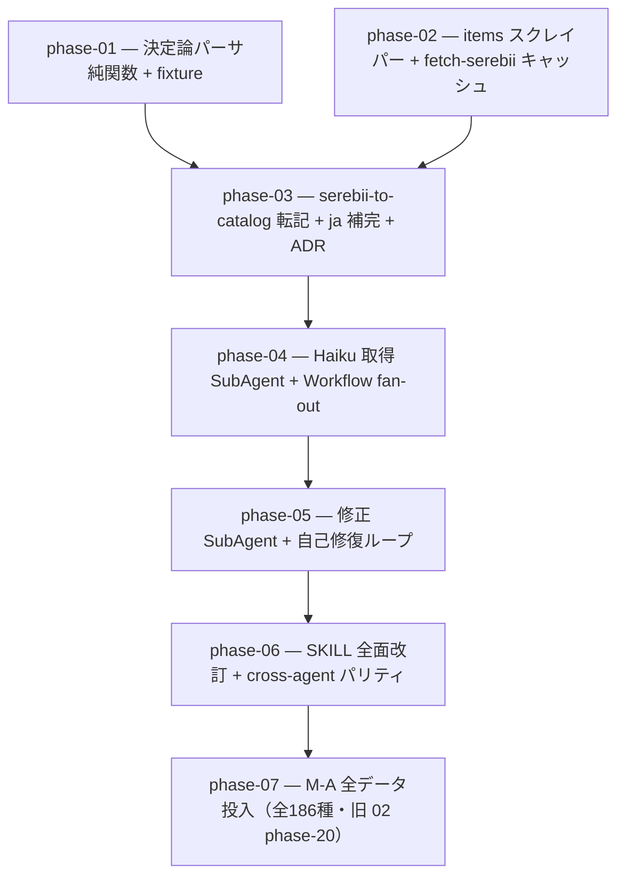

# 03-survey-regulation-rework — survey-regulation 刷新（決定論スクレイパー + 自己修復）（実装計画インデックス）

`survey-regulation` skill による Champions 解禁データ取得を、LLM の WebFetch 目視抽出から **決定論スクレイパー
（cheerio）+ Haiku 取得 SubAgent + 修正 SubAgent 自己修復（ハイブリッド3層）**へ刷新する計画群。トークン消費の
削減と正確性の向上を狙い、最後に新パイプラインで M-A 全186種を投入する。02-data-model-redesign の最終 phase
だった「M-A 全データ投入」は新パイプラインで実行すべきため、本計画群の Phase 7 へ移動した。

> 設計の正本は [`OVERVIEW.md`](./OVERVIEW.md)（ゴール / 背景 / 設計方針 / 実装指針 / スコープ外 /
> 計画群全体の受け入れ基準）。規約は [`.claude/rules/data-pipeline.md`](../../../.claude/rules/data-pipeline.md) /
> 情報源方針は [`serebii-sourcing.md`](../../../.claude/skills/survey-regulation/references/serebii-sourcing.md)。

## フェーズ依存グラフ

## フェーズ一覧（この順で実施）

- [x] [Phase 1 — 決定論パーサ純関数 + fixture テスト（cheerio・latin-1・slug 正規化・自己検証 exit code）](./phase-01-deterministic-parser.md)
- [x] [Phase 2 — items スクレイパー + fetch-serebii キャッシュ（Hold/Berries/Mega Stones・data/raw/serebii/）](./phase-02-items-and-fetch-cache.md)
- [x] [Phase 3 — serebii-to-catalog 転記 + ja 補完 + パイプライン結合 + ADR（append-only・PokeAPI names）](./phase-03-catalog-writer-and-adr.md)
- [x] [Phase 4 — Haiku 取得 SubAgent + Workflow fan-out（層2・HTML を読まない・冪等キャッシュ）](./phase-04-haiku-fetch-fanout.md)
- [ ] [Phase 5 — 修正 SubAgent + 自己修復ループ（層3・K 回上限・エスカレーション）](./phase-05-self-healing-loop.md)
- [ ] [Phase 6 — SKILL.md 全面改訂 + cross-agent パリティ + ツール整備](./phase-06-skill-rewrite-and-parity.md)
- [ ] [Phase 7 — M-A 全データ投入（全186種 + 全 movepool・新パイプライン経由・旧 02 phase-20）](./phase-07-ma-full-data.md)

> 計画群全体の受け入れ基準は [`OVERVIEW.md` の「受け入れ基準」節](./OVERVIEW.md#受け入れ基準) を参照。

## 補足

- 各 phase doc は [`plan-templates.md`](../../../.claude/skills/plans-new/references/plan-templates.md) の
  「phase-NN-<slug>.md」節（テンプレ正本）に従う。
- スキル作成・改修は `skill-creator`、ADR は `adr-new`（[[skill-authoring]] / [[adr]]）。層2-3 の SubAgent
  オーケストレーションは Workflow スクリプトで実装する（OVERVIEW 設計方針）。
- Phase 7 は 02-data-model-redesign の旧 phase-20（M-A 全データ投入）を移動・改稿したもの。新パイプライン
  （決定論スクレイパー + 自己修復）経由で全186種を投入する点が旧 doc から更新されている。
