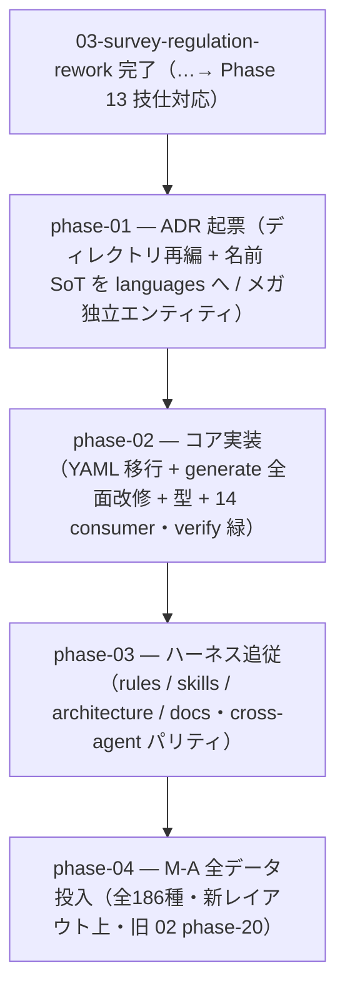

# 04-generated-layout-redesign — generated / YAML ディレクトリ構成の再編（実装計画インデックス）

`data/generated/`（生成 TS）と `data/champions/`（ソース YAML）を、**構造（言語非依存 specs）/ 名前（ゲーム非依存 languages）/ レギュ解禁（per-reg）の 3 軸**で直交させたディレクトリ構成へ再編し（Phase 1-3）、**その新レイアウト上で M-A 全186種を全量投入して M-A を完成させる（最終 Phase 4）**計画群。per-reg を `species`/`items`/`mega`/`species-moves` の 4 オブジェクトへ分割し、`index.ts` は id + period のみで集約、名前を `languages/` へ分離、メガを独立 spec エンティティ化する。先行する 03-survey-regulation-rework（取得刷新 + 技仕様の Champions 対応）を完了してから着手する（一方通行 03 → 04）。

> 設計の正本は [`OVERVIEW.md`](./OVERVIEW.md)（ゴール / 背景 / 設計方針 / 実装指針 / スコープ外 / 計画群全体の受け入れ基準）。規約は [`.claude/rules/data-pipeline.md`](../../../.claude/rules/data-pipeline.md) / [`.claude/rules/type-conventions.md`](../../../.claude/rules/type-conventions.md)。

## フェーズ依存グラフ

## フェーズ一覧（この順で実施）

- [ ] [Phase 1 — ADR 起票（generated/YAML ディレクトリ再編 + 名前 SoT を languages へ / メガ独立 spec エンティティ・ADR 0025/0032/0034 追補）](./phase-01-adr-layout-and-mega-entity.md)
- [ ] [Phase 2 — コア実装（YAML 新ツリー移行 + generate.ts 全面改修 + materialize/fetch/serebii-to-catalog 追従 + 型レイヤ + 14 consumer + 公開API + テスト fixture・verify 緑）](./phase-02-core-rewrite.md)
- [ ] [Phase 3 — ハーネス追従（rules / skills / architecture / docs・cross-agent パリティ・パス参照一掃）](./phase-03-harness-followup.md)
- [ ] [Phase 4 — M-A 全データ投入（全186種 + 全 movepool・新パイプライン経由・新レイアウト上・旧 02 phase-20）](./phase-04-ma-full-data.md)

> 計画群全体の受け入れ基準は [`OVERVIEW.md` の「受け入れ基準」節](./OVERVIEW.md#受け入れ基準) を参照。
> **依存は一方通行**: 先行する [03-survey-regulation-rework](../03-survey-regulation-rework/README.md)（取得刷新 + Phase 13 技仕様の Champions 対応）を完了 → 本計画群（Phase 1-3 再編 → Phase 4 全種族投入）。03 へ戻る依存は無い。

## 補足

- 各 phase doc は [`plan-templates.md`](../../../.claude/skills/plans-new/references/plan-templates.md) の「phase-NN-<slug>.md」節（テンプレ正本）に従う。
- ADR は `adr-new`、skill 改修は `skill-creator`（[[adr]] / [[skill-authoring]]）。
- **着手前提**: 先行する 03-survey-regulation-rework を最終 Phase 13（技仕様の Champions 対応・現行レイアウトで技メタ値を是正）まで完了してから本計画群に入る。Phase 1-3 で再編 → **Phase 4 で全種族投入**（03 Phase 13 で是正済みの技メタ値が、Phase 2 のレイアウト再編で新ツリーへ移行される）。
- **最大リスク = reg-aware 型機構の保全**（`m-a/index.ts` の `speciesDex` 合成が `PerRegSpecies` 形を維持できないと individual/party のブランドエラーが崩れる）。Phase 2 の中心課題。
