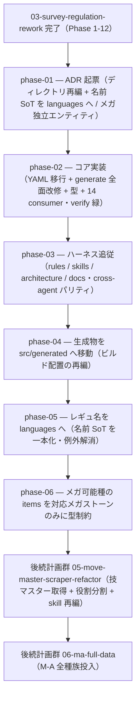

# 04-generated-layout-redesign — generated / YAML ディレクトリ構成の再編（実装計画インデックス）

`data/generated/`（生成 TS）と `data/champions/`（ソース YAML）を、**構造（言語非依存 specs）/ 名前（ゲーム非依存 languages）/ レギュ解禁（per-reg）の 3 軸**で直交させたディレクトリ構成へ再編する計画群（Phase 1-6）。per-reg を `species`/`items`/`mega`/`species-moves` の 4 オブジェクトへ分割し、`index.ts` は id + period のみで集約、名前を `languages/` へ分離、メガを独立 spec エンティティ化する（Phase 1-3）。さらに**配置の最終化**として、生成物を `src/generated/` へ移動（Phase 4）、レギュ名を languages へ移して名前 SoT を例外なく一本化（Phase 5）、メガ可能種の `items` を対応メガストーンのみに型制約（Phase 6）する。先行する 03-survey-regulation-rework（取得刷新）を完了してから着手する。**M-A 全186種の全量投入は後続計画群 [`06-ma-full-data`](../06-ma-full-data/README.md) へ分離**し、本計画群はレイアウト再編に責務を純化する（一方通行 03 → 04 → 05 → 06）。

> 設計の正本は [`OVERVIEW.md`](./OVERVIEW.md)（ゴール / 背景 / 設計方針 / 実装指針 / スコープ外 / 計画群全体の受け入れ基準）。規約は [`.claude/rules/data-pipeline.md`](../../../.claude/rules/data-pipeline.md) / [`.claude/rules/type-conventions.md`](../../../.claude/rules/type-conventions.md)。

## フェーズ依存グラフ

## フェーズ一覧（この順で実施）

- [x] [Phase 1 — ADR 起票（generated/YAML ディレクトリ再編 + 名前 SoT を languages へ / メガ独立 spec エンティティ・ADR 0025/0032/0034 追補）](./phase-01-adr-layout-and-mega-entity.md)
- [x] [Phase 2 — コア実装（YAML 新ツリー移行 + generate.ts 全面改修 + materialize/fetch/serebii-to-catalog 追従 + 型レイヤ + 14 consumer + 公開API + テスト fixture・verify 緑）](./phase-02-core-rewrite.md)
- [x] [Phase 3 — ハーネス追従（rules / skills / architecture / docs・cross-agent パリティ・パス参照一掃）](./phase-03-harness-followup.md)
- [x] [Phase 4 — 生成物を `data/generated/` から `src/generated/` へ移動（emit ルート + consumer パス + ツール glob 除外・旧パス一掃）](./phase-04-generated-into-src.md)
- [x] [Phase 5 — レギュ名 `name:{ja,en}` を `data/languages/` へ移し名前 SoT を一本化（languages 列挙の例外解消）](./phase-05-regulation-name-to-languages.md)
- [x] [Phase 6 — メガ可能種の `items` を対応メガストーンのみに型制約（`ItemNotHeldBy` で他持ち物をブランド）](./phase-06-mega-item-legality.md)

> 計画群全体の受け入れ基準は [`OVERVIEW.md` の「受け入れ基準」節](./OVERVIEW.md#受け入れ基準) を参照。
> **依存は一方通行**: 先行する [03-survey-regulation-rework](../03-survey-regulation-rework/README.md)（取得刷新・Phase 1-12）を完了 → 本計画群（04・Phase 1-6 レイアウト再編 + 配置最終化）→ [05-move-master-scraper-refactor](../05-move-master-scraper-refactor/README.md)（技マスター取得 + 役割分割 + skill 再編）→ [06-ma-full-data](../06-ma-full-data/README.md)（全種族投入）。前計画へ戻る依存は無い。**全種族投入（旧 Phase 4）は本計画群から 06 へ分離した**（本計画群の Phase 4-6 は別テーマ = 生成物配置 / 名前 SoT / メガ items legality）。

## 補足

- 各 phase doc は [`plan-templates.md`](../../../.claude/skills/plans-new/references/plan-templates.md) の「phase-NN-<slug>.md」節（テンプレ正本）に従う。
- ADR は `adr-new`、skill 改修は `skill-creator`（[[adr]] / [[skill-authoring]]）。
- **着手前提**: 先行する 03-survey-regulation-rework（Phase 1-12）を完了してから本計画群に入る。本計画群は Phase 1-3 でレイアウトを再編し、**全種族投入は後続 [06-ma-full-data](../06-ma-full-data/README.md) へ分離**した。技メタの Champions 準拠化は後続 [05-move-master-scraper-refactor](../05-move-master-scraper-refactor/README.md)（技マスター専用取得経路）が担う（旧 03 Phase 13 の手動是正は 05 へ吸収して廃止）。
- **最大リスク = reg-aware 型機構の保全**（`m-a/index.ts` の `speciesDex` 合成が `PerRegSpecies` 形を維持できないと individual/party のブランドエラーが崩れる）。Phase 2 の中心課題。
