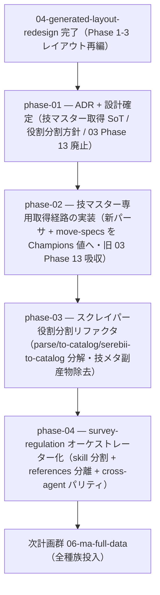

# 05-move-master-scraper-refactor — 技マスター専用取得 + スクレイパー役割分割 + survey-regulation オーケストレーター化（実装計画インデックス）

Champions 解禁データの取得パイプラインを、**情報種別ごとに役割分割**して保守性を上げる計画群。① 技そのものの情報
（威力・命中・タイプ・分類・PP）を Serebii 技専用ページから**独立スクレイピング取得する経路**を新設して技メタを
Champions 準拠へ揃え、② スクレイピングコード（`parse.ts` / `to-catalog.ts` / `serebii-to-catalog.ts`）を責務別に分解し、
③ 肥大した `survey-regulation` skill を情報種別ごとに分割して**オーケストレーターに徹させる**。先行する
[`04-generated-layout-redesign`](../04-generated-layout-redesign/README.md) のレイアウト再編（`move-specs` 独立）を完了して
から着手する（一方通行 04 → 05 → 06）。

> 設計の正本は [`OVERVIEW.md`](./OVERVIEW.md)（ゴール / 背景 / 設計方針 / 実装指針 / スコープ外 / 計画群全体の受け入れ
> 基準）。規約は [`.claude/rules/data-pipeline.md`](../../../.claude/rules/data-pipeline.md) /
> [`.claude/rules/skill-authoring.md`](../../../.claude/rules/skill-authoring.md)。情報源方針は
> [`serebii-sourcing.md`](../../../.claude/skills/survey-regulation/references/serebii-sourcing.md)。

## フェーズ依存グラフ

## フェーズ一覧（この順で実施）

- [x] [Phase 1 — ADR + 設計確定（技マスター専用取得の SoT・新取得経路の DOM 仕様・役割分割方針・skill 再編方針・03 Phase 13 廃止の記録）](./phase-01-design-and-adr.md)
- [ ] [Phase 2 — 技マスター専用取得経路の実装（Serebii 技専用ページの新パーサ + fetch/scrape/transcribe + exit code + fixture + move-specs を Champions 準拠値で populate・旧 03 Phase 13 を吸収）](./phase-02-move-master-fetch.md)
- [ ] [Phase 3 — スクレイパー役割分割リファクタ（parse.ts / to-catalog.ts / serebii-to-catalog.ts を責務別に分解・種族ページからの技メタ副産物抽出を除去）](./phase-03-scraper-decomposition.md)
- [ ] [Phase 4 — survey-regulation オーケストレーター化（roster / species-moves / move-master / items のサブスキル / Workflow 分割 + SKILL.md 縮減 + cross-agent パリティ）](./phase-04-skill-orchestration.md)

> 計画群全体の受け入れ基準は [`OVERVIEW.md` の「受け入れ基準」節](./OVERVIEW.md#受け入れ基準) を参照。
> **依存は一方通行**: 先行する [04-generated-layout-redesign](../04-generated-layout-redesign/README.md)（Phase 1-3 再編）
> を完了 → 本計画群（05）→ [06-ma-full-data](../06-ma-full-data/README.md)（全種族投入）。04 / 06 へ戻る依存は無い。

## 補足

- 各 phase doc は [`plan-templates.md`](../../../.claude/skills/plans-new/references/plan-templates.md) の
  「phase-NN-<slug>.md」節（テンプレ正本）に従う。
- ADR は `adr-new`、skill 作成・改修は `skill-creator`（[[adr]] / [[skill-authoring]]）。層2-3 の SubAgent
  オーケストレーションは Workflow スクリプトで実装する（OVERVIEW 設計方針・[[cross-agent]] のフォールバック明記）。
- **旧 03 Phase 13（技仕様の Champions 対応・技メタ値の手動是正）は本計画群へ吸収して廃止した**。手動是正の代わりに、
  Phase 2 の技マスター専用取得経路が Serebii から Champions 準拠値を取得して `move-specs` を正す（根本解決）。
- **着手前提**: 先行する [04-generated-layout-redesign](../04-generated-layout-redesign/README.md) を Phase 1-3
  （レイアウト再編・`move-specs` 独立エンティティ化）まで完了してから本計画群に入る。本計画群完了後、`move-specs` が
  Champions 準拠で揃い整理済みパイプラインができた状態で [06-ma-full-data](../06-ma-full-data/README.md) の全種族投入へ繋ぐ。
