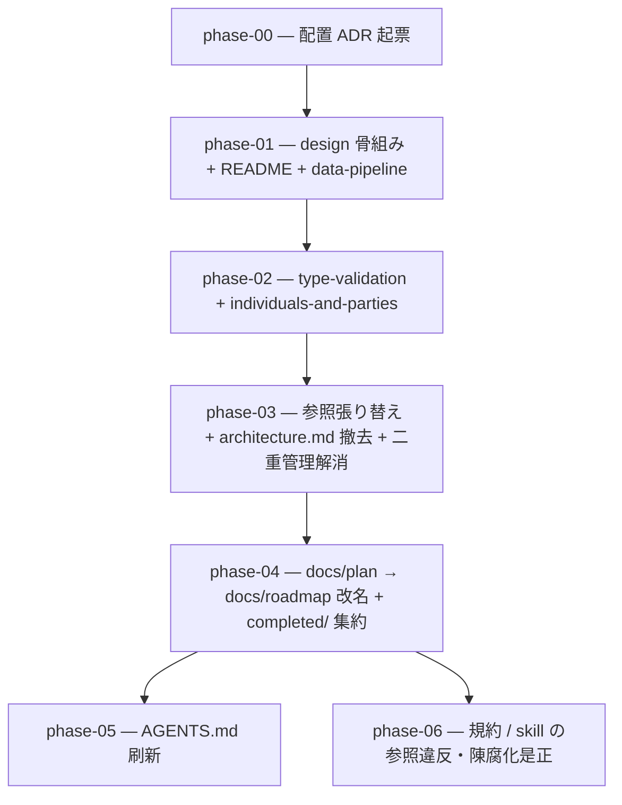

# 07-docs-restructure — ドキュメント構成の再編（実装計画インデックス）

`docs/plan/01-mvp/architecture.md`（規約 spec 正本）を `docs/design/`（コードなし設計俯瞰）へテーマ別分割昇格し、`docs/plan` → `docs/roadmap` 改名 + `completed/` 集約、AGENTS.md 刷新、SoT 二重管理解消までを行う計画群。知識の種類ごとに正本を一意化し、他層は参照（point, don't repeat）する構成へ寄せる。

> 設計の正本は [`OVERVIEW.md`](./OVERVIEW.md)（ゴール / 背景 / 設計方針 / 実装指針 / スコープ外 / 計画群全体の受け入れ基準）。事前調査は [`docs/refactor-survey-2026-06-21.md`](../../refactor-survey-2026-06-21.md)。
>
> **棲み分け**: `docs/roadmap/`（旧 `docs/plan/`）= 実装の計画・進捗・完了履歴（mutable WIP）。`docs/design/`（本計画で新設）= 設計の俯瞰・なぜ（現在どう成り立っているか・コードなし Explanation）。

## フェーズ依存グラフ

## フェーズ一覧（この順で実施）

- [ ] [Phase 0 — 配置 ADR 起票（design 新設・命名・roadmap 改名・責務境界）](./phase-00-placement-adr.md)
- [ ] [Phase 1 — docs/design/ 骨組み + README + data-pipeline.md](./phase-01-design-scaffold-data-pipeline.md)
- [ ] [Phase 2 — type-validation.md + individuals-and-parties.md](./phase-02-design-type-and-individuals.md)
- [ ] [Phase 3 — inbound 参照張り替え + 旧 architecture.md 撤去 + 二重管理解消](./phase-03-rewire-and-retire-architecture.md)
- [ ] [Phase 4 — docs/plan → docs/roadmap 改名 + completed/ 集約 + 参照追従](./phase-04-roadmap-rename.md)
- [ ] [Phase 5 — AGENTS.md 刷新](./phase-05-agents-md-refresh.md)
- [ ] [Phase 6 — 規約 / skill の plan 参照違反・陳腐化是正](./phase-06-rule-skill-staleness-fix.md)

## 補足

- 各 phase doc は [plan-templates.md](../../../.claude/skills/plans-new/references/plan-templates.md) の「phase-NN-<slug>.md」節に従う。
- ADR は `adr-new`、skill 改修は `skill-creator`（[[adr]] / [[skill-authoring]]）。各 PR は `harness-review` でセルフレビューし cross-agent パリティを点検する（[[cross-agent]]）。
- rules / skills の純シンプル化（文体圧縮）は後続 [`08-rules-skills-simplify`](../08-rules-skills-simplify/README.md)。
