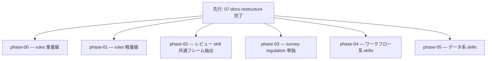

# 08-rules-skills-simplify — rules / skills の純シンプル化（実装計画インデックス）

15 rules・16 skills の冗長（frontmatter 肥大・本文重複・「なぜ」過剰・SoT 実体再記述・learning 番号羅列の 5 類型）を、意味・trigger 精度・安全性記述・自己完結性を保ったまま圧縮する計画群。ARID に従い「実体の重複」を削り、共通手順は rule へ一本化する。

> 設計の正本は [`OVERVIEW.md`](./OVERVIEW.md)（ゴール / 背景 / 設計方針 / 実装指針 / スコープ外 / 計画群全体の受け入れ基準 + やりすぎ防止の判断線）。事前調査は [`docs/refactor-survey-2026-06-21.md`](../../refactor-survey-2026-06-21.md) §5。
>
> **着手前提**: 先行計画 [`07-docs-restructure`](../07-docs-restructure/README.md) の完了。07 が配置・参照・二重管理を確定させた上で 08 が文体を圧縮する。

## フェーズ依存グラフ

> Phase 0〜5 は相互にほぼ独立（別ファイル群）で並行可能。共通の着手前提は 07 完了のみ。

## フェーズ一覧（順不同・並行可）

- [ ] [Phase 0 — rules 重量級シンプル化（implementation-workflow / data-pipeline）](./phase-00-rules-heavy.md)
- [ ] [Phase 1 — rules 軽量級シンプル化（残り rules）](./phase-01-rules-light.md)
- [ ] [Phase 2 — レビュー skill 共通フレーム抽出](./phase-02-review-skill-common-frame.md)
- [ ] [Phase 3 — survey-regulation 単独圧縮](./phase-03-survey-regulation.md)
- [ ] [Phase 4 — ワークフロー系 skills 圧縮](./phase-04-workflow-skills.md)
- [ ] [Phase 5 — データ系 skills 圧縮](./phase-05-data-skills.md)

## 補足

- 各 phase doc は [plan-templates.md](../../../.claude/skills/plans-new/references/plan-templates.md) の「phase-NN-<slug>.md」節に従う。
- skill 改修は `skill-creator`、rule 改修は [[skill-authoring]] 基準を直接適用。各 PR は `harness-review` でセルフレビューし trigger 精度・cross-agent パリティ・references dangling を点検する（[[cross-agent]]）。
- **やりすぎ防止**: 圧縮の判断線は OVERVIEW の設計方針（§5.5 由来の 5 点）を厳守する。
