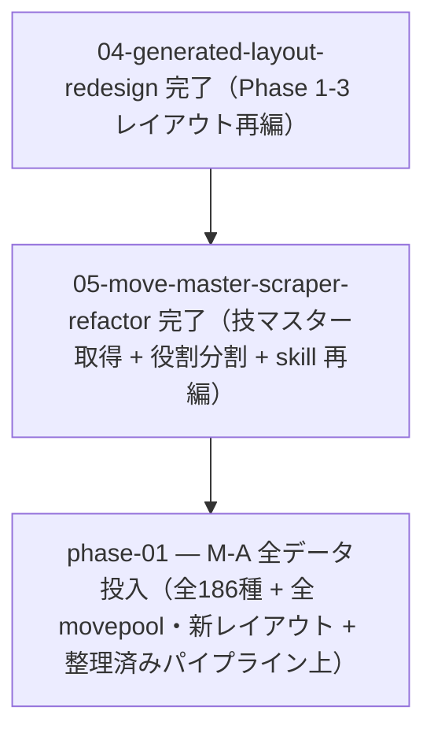

# 09-ma-full-data — M-A 全種族投入（実装計画インデックス）

レギュレーション M-A の**全186種・全技・全持ち物・全メガ**を、整備済みの取得パイプラインと新レイアウトの上で全量投入し
M-A を完成させる計画群。02 の旧 phase-20 を起源に複数回の cross-plan move を経て独立計画群として確定した。新規実装はせず、
[03-survey-regulation-rework](../03-survey-regulation-rework/README.md)（取得刷新）+
[04-generated-layout-redesign](../04-generated-layout-redesign/README.md)（レイアウト再編）+
[05-move-master-scraper-refactor](../05-move-master-scraper-refactor/README.md)（技マスター取得 + 役割分割 + skill 再編）
で整えた仕組みに投入を委譲する（一方通行 04 → 05 → 09）。

> 設計の正本は [`OVERVIEW.md`](./OVERVIEW.md)（ゴール / 背景 / 設計方針 / 実装指針 / スコープ外 / 計画群全体の受け入れ
> 基準）。規約は [`.claude/rules/data-pipeline.md`](../../../.claude/rules/data-pipeline.md)。情報源方針は
> [`serebii-sourcing.md`](../../../.claude/skills/survey-regulation/references/serebii-sourcing.md)。

## フェーズ依存グラフ

## フェーズ一覧（この順で実施）

- [ ] [Phase 1 — M-A 全データ投入（全186種 + 全 movepool・新パイプライン経由・新レイアウト上・技マスターは 05 で Champions 準拠へ是正済み）](./phase-01-ma-full-data.md)

> 計画群全体の受け入れ基準は [`OVERVIEW.md` の「受け入れ基準」節](./OVERVIEW.md#受け入れ基準) を参照。
> **依存は一方通行**: 先行する [04-generated-layout-redesign](../04-generated-layout-redesign/README.md)（Phase 1-3 再編）
> → [05-move-master-scraper-refactor](../05-move-master-scraper-refactor/README.md)（技マスター取得 + 役割分割）→ 本計画群
> （09）。04 / 05 へ戻る依存は無い。

## 補足

- 各 phase doc は [`plan-templates.md`](../../../.claude/skills/plans-new/references/plan-templates.md) の
  「phase-NN-<slug>.md」節（テンプレ正本）に従う。
- **データ投入 PR（>1000 行）を 1 PR 許容**: M-A は約186種・各種族数十技規模で意味ある粒度分割が困難なため 1 PR とする
  （[[planning]] の例外・[`OVERVIEW.md`](./OVERVIEW.md#phase-分割6-基準の評価サマリ) に根拠記載）。
- **着手前提**: 先行する 04（レイアウト再編）→ 05（技マスター取得 + 役割分割 + skill 再編）を完了してから本計画群に入る。
  技メタの正しさは 05 Phase 2 で担保済み（旧 03 Phase 13 の手動是正を代替・根本解決）。
- 取りこぼし・使い勝手の問題があれば `survey-regulation` を `skill-creator` で改修（[[skill-authoring]] / [[adr]]）。
