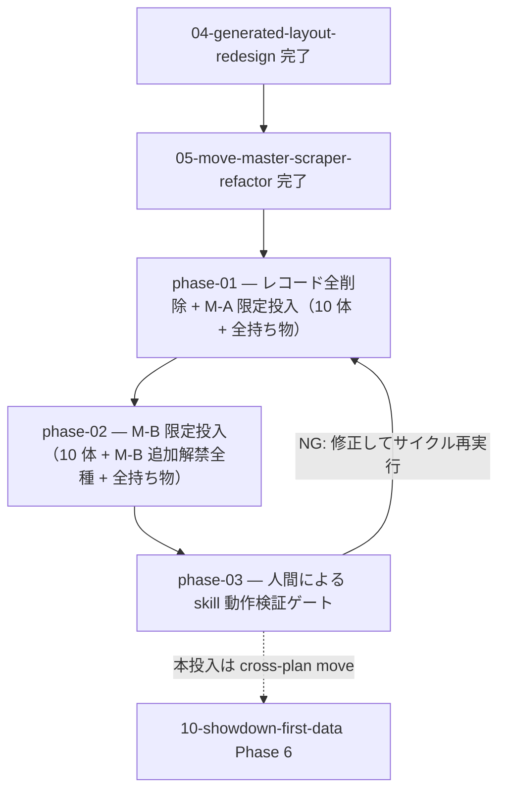

# 09-champions-data-rollout — M-A/M-B 解禁データ投入（実装計画インデックス）

> **本投入（旧 Phase 4）は [10-showdown-first-data](../10-showdown-first-data/README.md) の Phase 6 へ cross-plan move された**。取得方式が **pokemon-showdown 第一の正**へ刷新されたため（[10 OVERVIEW](../10-showdown-first-data/OVERVIEW.md)）、旧 `survey-regulation` + Serebii 第一優先での全量投入は plan 10 の新パイプライン（showdown-sync + verify-showdown-pr 照合）が引き継ぐ。本計画群は限定セットでの skill 実地検証（Phase 1-3）に範囲が縮小する。**Phase 3 の `survey-regulation` 検証ゲートも plan 10 で survey-regulation が廃止されるため、実質 plan 10 の `verify-showdown-pr` 照合へ置換される見込み**。

レギュレーション M-A・M-B の解禁データ（種族 / 技 / 持ち物 / メガ）を、整備済みの取得パイプライン + 新レイアウトの上で投入し両レギュを完成させる計画群。全量投入の前に **`survey-regulation` スキルを限定セット（M-A 代表 10 体・M-B 追加解禁種）で実地検証する人間ゲート**を挟み、skill 健全性を確認してから本投入する。02 の旧 phase-20 を起源に複数回の cross-plan move を経て独立計画群として確定し、本計画で採番を `XX-` → `09` に確定した。新規実装は原則せず、
[03-survey-regulation-rework](../completed/03-survey-regulation-rework/README.md)（取得刷新）+
[04-generated-layout-redesign](../completed/04-generated-layout-redesign/README.md)（レイアウト再編）+
[05-move-master-scraper-refactor](../completed/05-move-master-scraper-refactor/README.md)（技マスター取得 + 役割分割 + skill 再編）
で整えた仕組みに投入を委譲する（一方通行 04 → 05 → 09）。例外は検証ゲートで判明した範囲の skill 改修。

> 設計の正本は [`OVERVIEW.md`](./OVERVIEW.md)（ゴール / 背景 / 設計方針 / 実装指針 / スコープ外 / 計画群全体の受け入れ
> 基準）。規約は [`.claude/rules/data-pipeline.md`](../../../.claude/rules/data-pipeline.md)。情報源方針は
> [`serebii-sourcing.md`](../../../.claude/skills/survey-regulation/references/serebii-sourcing.md)。

## フェーズ依存グラフ

## フェーズ一覧（この順で実施）

- [x] [Phase 1 — レコード全削除 + M-A 限定投入（リザードン・スターミー・ゲンガー含む 10 体 + 全持ち物）](./phase-01-reset-and-ma-limited.md)
- [x] [Phase 2 — M-B 限定投入（M-A の 10 体 + M-B 追加解禁全種 + 全持ち物）](./phase-02-mb-limited.md)
- [ ] [Phase 3 — 人間による `survey-regulation` skill 動作検証ゲート（NG なら P1-2 サイクル再実行）](./phase-03-skill-verification-gate.md)
- ~~Phase 4 — M-A・M-B 全解禁情報の本投入~~ → **[10-showdown-first-data Phase 6](../10-showdown-first-data/phase-06-full-rollout.md) へ cross-plan move**（取得方式刷新のため showdown 経路へ改訂）

> 計画群全体の受け入れ基準は [`OVERVIEW.md` の「受け入れ基準」節](./OVERVIEW.md#受け入れ基準) を参照。
> **依存は一方通行**: 先行する [04-generated-layout-redesign](../completed/04-generated-layout-redesign/README.md)（Phase 1-3 再編）
> → [05-move-master-scraper-refactor](../completed/05-move-master-scraper-refactor/README.md)（技マスター取得 + 役割分割）→ 本計画群
> （09）。04 / 05 へ戻る依存は無い。Phase 3 の検証ゲートのみ Phase 1 へ戻るサイクルを持つ（skill 改修時）。

## 補足

- 各 phase doc は [`plan-templates.md`](../../../.claude/skills/plans-new/references/plan-templates.md) の
  「phase-NN-<slug>.md」節（テンプレ正本）に従う。
- **本投入（旧 Phase 4）は [10-showdown-first-data Phase 6](../10-showdown-first-data/phase-06-full-rollout.md) へ移動**: 取得方式が pokemon-showdown 第一の正へ刷新されたため、全量本投入は plan 10 の新パイプラインが引き継ぐ。本計画群の Phase 1-2 限定セットは中規模。
- **着手前提**: 先行する 04（レイアウト再編）→ 05（技マスター取得 + 役割分割 + skill 再編）を完了済み。
  技メタの正しさは 05 Phase 2 で担保済み（旧 03 Phase 13 の手動是正を代替・根本解決）。
- **検証ゲートでの取りこぼし・使い勝手の問題**は `survey-regulation` を `skill-creator` で改修して解消する（[[skill-authoring]] / [[adr]]）。
