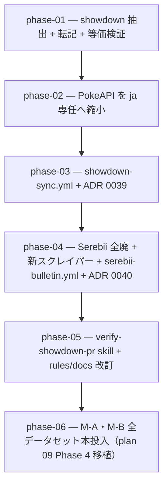

# 10-showdown-first-data — データ取得を pokemon-showdown 第一の正へ刷新（実装計画インデックス）

レギュレーション別データの取得元を「Serebii 第一優先 + PokeAPI 構造取得」から「**pokemon-showdown 第一の正 + Serebii 速報 + PokeAPI は日本語名 ja 専任**」へ転換し、取得を GitHub Actions（手動 dispatch）へ移管する計画群。SoT レイアウト・`generate.ts`・型・検証ゲートは不変のまま、**入力 SoT を埋める取得元のみを差し替える**。

> 設計の正本は [`OVERVIEW.md`](./OVERVIEW.md)（ゴール / 背景 / 設計方針 / 実装指針 / スコープ外 / 計画群全体の受け入れ基準）。規約は [`.claude/rules/data-pipeline.md`](../../../.claude/rules/data-pipeline.md)。

## フェーズ依存グラフ

## フェーズ一覧（この順で実施）

- [ ] [Phase 1 — showdown 抽出 + 転記 + 等価検証](./phase-01-showdown-extract-transcribe.md)
- [ ] [Phase 2 — PokeAPI を日本語名 ja 専任へ縮小・構造取得廃止](./phase-02-pokeapi-ja-only.md)
- [ ] [Phase 3 — showdown-sync ワークフロー + ADR 0039](./phase-03-showdown-sync-workflow.md)
- [ ] [Phase 4 — Serebii 完全廃止 + 新スクレイパー + serebii-bulletin + ADR 0040](./phase-04-serebii-bulletin-rebuild.md)
- [ ] [Phase 5 — verify-showdown-pr skill + rules / docs 改訂](./phase-05-verify-skill-and-rules.md)
- [ ] [Phase 6 — M-A・M-B 全データセット本投入（plan 09 Phase 4 の cross-plan move）](./phase-06-full-rollout.md)

## 補足

- 各 phase doc は本テンプレ（[plan-templates.md](../../../.claude/skills/plans-new/references/plan-templates.md) の「phase-NN-<slug>.md」節）に従う。
- スキル作成は `skill-creator`、ADR は `adr-new`（[[skill-authoring]] / [[adr]]）。
- **Phase 6 は plan 09 Phase 4 の移植**: 旧 [09-champions-data-rollout](../09-champions-data-rollout/README.md) の最終フェーズ（全データセット本投入）を本計画群へ cross-plan move し、新パイプライン（showdown-sync 全量投入 + verify-showdown-pr 照合）へ改訂したもの。移動・参照追従は [[planning]] の cross-plan move チェックリストに従う。
- **Phase 6（本投入）は >1000 行を 1 PR 許容**: 全種・全 movepool 規模で意味ある粒度分割が困難なため（[[planning]] 6 基準⑤ の例外・[`OVERVIEW.md`](./OVERVIEW.md#phase-分割6-基準の評価サマリ) に根拠）。
