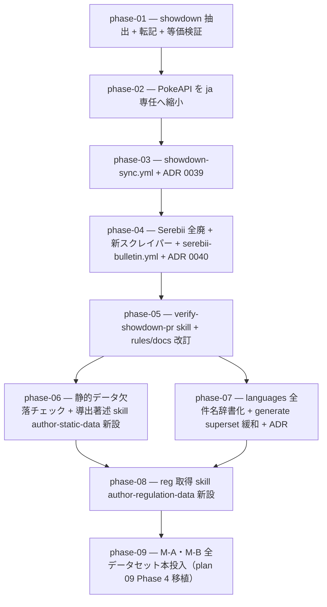

# 10-showdown-first-data — データ取得を pokemon-showdown 第一の正へ刷新（実装計画インデックス）

レギュレーション別データの取得元を「Serebii 第一優先 + PokeAPI 構造取得」から「**pokemon-showdown 第一の正 + Serebii 速報 + PokeAPI は日本語名 ja 専任**」へ転換し、取得を GitHub Actions（手動 dispatch）へ移管する計画群。SoT レイアウト・`generate.ts`・型・検証ゲートは不変のまま、**入力 SoT を埋める取得元のみを差し替える**。

> 設計の正本は [`OVERVIEW.md`](./OVERVIEW.md)（ゴール / 背景 / 設計方針 / 実装指針 / スコープ外 / 計画群全体の受け入れ基準）。規約は [`.claude/rules/data-pipeline.md`](../../../.claude/rules/data-pipeline.md)。

## フェーズ依存グラフ

```mermaid
flowchart TD
    P1[phase-01 — showdown 抽出 + 転記 + 等価検証] --> P2[phase-02 — PokeAPI を ja 専任へ縮小]
    P2 --> P3[phase-03 — showdown-sync.yml + ADR 0039]
    P3 --> P4[phase-04 — Serebii 全廃 + 新スクレイパー + serebii-bulletin.yml + ADR 0040]
    P4 --> P5[phase-05 — verify-showdown-pr skill + rules/docs 改訂]
    P5 --> P6[phase-06 — 静的データ欠落チェック + 導出著述 skill author-static-data 新設]
    P5 --> P7[phase-07 — languages 全件名辞書化 + generate superset 緩和 + ADR]
    P6 --> P8[phase-08 — reg 取得 skill author-regulation-data 新設]
    P7 --> P8
    P8 --> P9[phase-09 — M-A・M-B 全データセット本投入（plan 09 Phase 4 移植）]
```

## フェーズ一覧（この順で実施）

- [x] [Phase 1 — showdown 抽出 + 転記 + 等価検証](./phase-01-showdown-extract-transcribe.md)
- [x] [Phase 2 — PokeAPI を日本語名 ja 専任へ縮小・構造取得廃止](./phase-02-pokeapi-ja-only.md)
- [x] [Phase 3 — showdown-sync ワークフロー + ADR 0039](./phase-03-showdown-sync-workflow.md)
- [x] [Phase 4 — Serebii 完全廃止 + 新スクレイパー + serebii-bulletin + ADR 0040](./phase-04-serebii-bulletin-rebuild.md)
- [x] [Phase 5 — verify-showdown-pr skill + rules / docs 改訂](./phase-05-verify-skill-and-rules.md)
- [ ] [Phase 6 — 静的データの欠落チェック + 導出著述 skill（author-static-data）新設](./phase-06-static-data-skill.md)
- [ ] [Phase 7 — languages を全件名辞書化（update-catalog 改訂 + generate superset 緩和 + ADR）](./phase-07-languages-full-catalog.md)
- [ ] [Phase 8 — レギュレーション取得の author-regulation-data skill 新設](./phase-08-author-regulation-data-skill.md)
- [ ] [Phase 9 — M-A・M-B 全データセット本投入（plan 09 Phase 4 の cross-plan move）](./phase-09-full-rollout.md)

## 補足

- 各 phase doc は本テンプレ（[plan-templates.md](../../../.claude/skills/plans-new/references/plan-templates.md) の「phase-NN-<slug>.md」節）に従う。
- スキル作成は `skill-creator`、ADR は `adr-new`（[[skill-authoring]] / [[adr]]）。
- **Phase 6 / 7 / 8 は後から挿入した分割 phase**: `data/` 完全削除からの復元を「静的データ著述（`author-static-data`・Phase 6）」「全件名辞書（`update-catalog` 改訂・Phase 7）」「reg 取得オーケストレーション（`author-regulation-data`・Phase 8・`showdown-sync.yml` は据え置き）」に 3 分割するため、本投入の手前へ挿入した（旧 full-rollout Phase 6 = 本投入は Phase 9 へ renumber・参照追従は [[planning]] の insert / renumber チェックリストに従う）。Phase 6 と 7 は独立 bootstrap（相互依存なし）、Phase 8 は両方に依存。
- **Phase 7 は generate 検証を限定緩和**: languages を全件名辞書（未解禁含む）にするため `generate.ts` の `requireNames` を bijection → specs ⊆ languages（orphan 許容）へ緩め、ADR 0035 を refine する新 ADR を起こす（plan 10 の「検証機構不変」原則の限定例外・OVERVIEW 設計方針に根拠）。
- **Phase 9 は plan 09 Phase 4 の移植**: 旧 [09-champions-data-rollout](../completed/09-champions-data-rollout/README.md) の最終フェーズ（全データセット本投入）を本計画群へ cross-plan move し、新パイプライン（`author-regulation-data` 実行 + verify-showdown-pr 照合）へ改訂したもの。移動・参照追従は [[planning]] の cross-plan move チェックリストに従う。
- **Phase 9（本投入）は >1000 行を 1 PR 許容**: 全種・全 movepool 規模で意味ある粒度分割が困難なため（[[planning]] 6 基準⑤ の例外・[`OVERVIEW.md`](./OVERVIEW.md#phase-分割6-基準の評価サマリ) に根拠）。skill / src 手順（Phase 6/7/8）はデータ投入（Phase 9）から分離済み。
