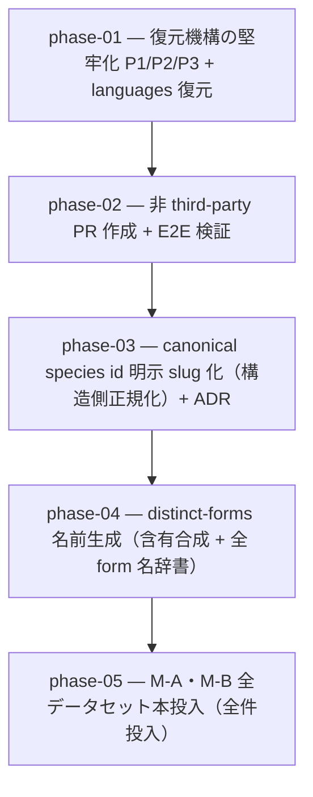

# 11-static-restore-hardening — 名前辞書 from-scratch 復元堅牢化 + 非 third-party PR 作成 + distinct-forms 名対応 + 全件本投入（実装計画インデックス）

`author-static-data`（`pokeapi-names.yml`）の**完全撤去状態からの復元**を、GitHub Actions 上で third-party
action 無しに全ステップ緑で通し、**フォルム・リージョン・性別等でタイプ / 種族値が変わる variety を canonical
明示 slug + 含有判定合成で正しく名付け**、最後に **M-A・M-B 全データセット本投入**まで到達させる計画群。動作確認で
判明した 3 前提（生成 ts 依存の順序 / 空 block map 不可 / PokeAPI 非提供の固有フォーム）と PR 作成の
third-party 依存を正し、PokeAPI/showdown の id スキーム食い違いを canonical 正規化で吸収する。

> 設計の正本は [`OVERVIEW.md`](./OVERVIEW.md)（ゴール / 背景 / 設計方針 / 実装指針 / スコープ外 /
> 計画群全体の受け入れ基準）。規約は [`.claude/rules/data-pipeline.md`](../../../.claude/rules/data-pipeline.md)。

## フェーズ依存グラフ

## フェーズ一覧（この順で実施）

- [x] [Phase 1 — 復元機構の堅牢化（P1 順序 / P2 materialize scaffold-free / P3 固有フォーム whitelist）+ languages 復元](./phase-01-restore-mechanism-hardening.md)（PR #221）
- [x] [Phase 2 — PR 作成を非 third-party 化（cpr → gh pr create ×3）+ E2E 検証](./phase-02-non-thirdparty-pr-creation.md)（PR #223・E2E run 28735319793 全緑）
- [ ] [Phase 3 — canonical species id の明示 slug 化（構造側 showdown 正規化）+ ADR](./phase-03-canonical-species-id.md)
- [ ] [Phase 4 — distinct-forms 名前生成（含有判定合成 + reg 非依存の全 form 名辞書）](./phase-04-distinct-forms-names.md)
- [ ] [Phase 5 — M-A・M-B 全データセット本投入（plan 10 Phase 9 の cross-plan move・全件投入）](./phase-05-full-rollout.md)

## 補足

- 各 phase doc は本テンプレ（[plan-templates.md](../../../.claude/skills/plans-new/references/plan-templates.md) の「phase-NN-<slug>.md」節）に従う。
- スキル作成は `skill-creator`、ADR は `adr-new`（[[skill-authoring]] / [[adr]]）。
- **Phase 3-4 の挿入（本投入の前段）**: フォルム/リージョン/性別対応（canonical 明示 slug + distinct-forms 名辞書）は、M-A・M-B が含む form を正しい id・表示名で投入するために**全件本投入（Phase 5）の前**に置く。PokeAPI/showdown の id スキーム食い違いを Phase 3 の canonical 正規化で吸収し、Phase 4 の含有合成で全 form 名を生成する。
- **Phase 5 は plan 10 Phase 9 の cross-plan move**: [completed/10-showdown-first-data](../completed/10-showdown-first-data/README.md) の未完 Phase 9（M-A・M-B 全データセット本投入）を本計画群へ移植したもの。plan 10 の他 phase は全完了ゆえ plan 10 は `completed/` へ集約した。移動・参照追従は [[planning]] の cross-plan move チェックリストに従う。
- **Phase 5（本投入）は >1000 行を 1 PR 許容**: 全種・全 movepool 規模で意味ある粒度分割が困難なため（[[planning]] 6 基準⑤ の例外・[`OVERVIEW.md`](./OVERVIEW.md#phase-分割6-基準の評価サマリ) に根拠）。
- **broken main の解消は Phase 1**: main は PR #218 の撤去で verify 赤。Phase 1 が fixed flow で languages を復元して緑へ戻し、以降の phase は緑 main 上で進む。
- **repo 設定「Allow GitHub Actions to create and approve pull requests」を有効化済み**（Phase 2・`can_approve_pull_request_reviews: true`）: GITHUB_TOKEN で `gh pr create`（および従来の cpr）が PR を作成するのに必須。3 つの data workflow（`pokeapi-names` / `showdown-sync` / `serebii-bulletin`）の PR 自動作成が動く前提。Phase 4 の `pokeapi-names` dispatch・Phase 5 の `showdown-sync` dispatch もこの設定に依存する。
