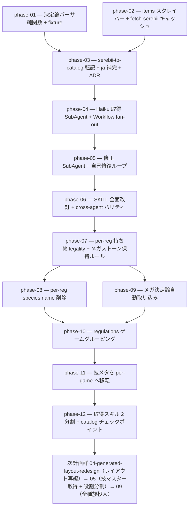

# 03-survey-regulation-rework — survey-regulation 刷新（決定論スクレイパー + 自己修復）（実装計画インデックス）

`survey-regulation` skill による Champions 解禁データ取得を、LLM の WebFetch 目視抽出から **決定論スクレイパー
（cheerio）+ Haiku 取得 SubAgent + 修正 SubAgent 自己修復（ハイブリッド3層）**へ刷新する計画群。トークン消費の
削減と正確性の向上を狙う。動作確認で判明した是正（per-reg 持ち物 legality・per-reg species name 削除・メガ決定論
取り込み）を Phase 7-9、データレイアウト整備（ゲームグルーピング・per-game 技メタ・取得スキル 2 分割）を Phase 10-12
として追加した。本計画群は **Phase 12 で完結**する（取得パイプライン刷新 + データレイアウト整備）。

> **後続計画群への一方通行**: 本計画群（03・取得パイプライン刷新）完了後、技仕様の Champions 対応（技マスターの値是正）
> とスクレイパー役割分割・skill オーケストレーター化は後続
> [`05-move-master-scraper-refactor`](../05-move-master-scraper-refactor/README.md) が、M-A 全186種の全量投入は
> [`09-champions-data-rollout`](../../09-champions-data-rollout/README.md) が担う。順序は **03（取得刷新・Phase 1-12）→ 04（generated/YAML
> レイアウト再編）→ 05（技マスター取得 + 役割分割 + skill 再編）→ 09（全種族投入）** の一方通行。
> **旧 03 Phase 13（技メタ値の手動是正）は 05 の技マスター専用取得経路へ吸収して廃止した**（手動是正の代わりに専用
> 取得で根本解決）。

> 設計の正本は [`OVERVIEW.md`](./OVERVIEW.md)（ゴール / 背景 / 設計方針 / 実装指針 / スコープ外 /
> 計画群全体の受け入れ基準）。規約は [`.claude/rules/data-pipeline.md`](../../../../.claude/rules/data-pipeline.md) /
> 情報源方針は [`serebii-sourcing.md`](../../../../.claude/skills/survey-regulation/references/serebii-sourcing.md)。

## フェーズ依存グラフ

## フェーズ一覧（この順で実施）

- [x] [Phase 1 — 決定論パーサ純関数 + fixture テスト（cheerio・latin-1・slug 正規化・自己検証 exit code）](./phase-01-deterministic-parser.md)
- [x] [Phase 2 — items スクレイパー + fetch-serebii キャッシュ（Hold/Berries/Mega Stones・data/raw/serebii/）](./phase-02-items-and-fetch-cache.md)
- [x] [Phase 3 — serebii-to-catalog 転記 + ja 補完 + パイプライン結合 + ADR（append-only・PokeAPI names）](./phase-03-catalog-writer-and-adr.md)
- [x] [Phase 4 — Haiku 取得 SubAgent + Workflow fan-out（層2・HTML を読まない・冪等キャッシュ）](./phase-04-haiku-fetch-fanout.md)
- [x] [Phase 5 — 修正 SubAgent + 自己修復ループ（層3・K 回上限・エスカレーション）](./phase-05-self-healing-loop.md)
- [x] [Phase 6 — SKILL.md 全面改訂 + cross-agent パリティ + ツール整備](./phase-06-skill-rewrite-and-parity.md)
- [x] [Phase 7 — per-reg 持ち物 legality（メガストーン保持ルール = base 全件 / メガ形態 = 対応ストーンのみ・megaSpecies リンク）](./phase-07-per-reg-item-legality.md)
- [x] [Phase 8 — per-reg species から不要な種族名 ja/en を削除（speciesBaseDex に集約）](./phase-08-per-reg-species-name-trim.md)
- [x] [Phase 9 — メガ関連の決定論自動取り込み（megaLinks / mega[] / megaSpecies 自動著述・ADR 0031 supersede）](./phase-09-deterministic-mega-capture.md)
- [x] [Phase 10 — regulations をゲームグルーピング（`regulations/champions/m-(a|b).yaml`）](./phase-10-game-grouped-regulations.md)
- [x] [Phase 11 — 技メタを per-game へ移転（catalog = 名前 / `regulations/champions/moves.yaml` = 技メタ・ADR 0026 改訂）](./phase-11-per-game-move-meta.md)
- [x] [Phase 12 — 取得スキルを 2 分割（catalog 取得 / regulations 取得）+ catalog 更新チェックポイント](./phase-12-update-skill-split.md)

> **全種族投入（M-A 全186種）は本計画群ではなく後続計画群 [`09-champions-data-rollout`](../../09-champions-data-rollout/README.md)** で実施する（04 のレイアウト再編 → 05 の技マスター取得 + 役割分割を経た新ツリー + 整理済みパイプライン上で投入）。技仕様の Champions 対応は [`05-move-master-scraper-refactor`](../05-move-master-scraper-refactor/README.md) が担う。

> 計画群全体の受け入れ基準は [`OVERVIEW.md` の「受け入れ基準」節](./OVERVIEW.md#受け入れ基準) を参照。

## 補足

- 各 phase doc は [`plan-templates.md`](../../../../.claude/skills/plans-new/references/plan-templates.md) の
  「phase-NN-<slug>.md」節（テンプレ正本）に従う。
- スキル作成・改修は `skill-creator`、ADR は `adr-new`（[[skill-authoring]] / [[adr]]）。層2-3 の SubAgent
  オーケストレーションは Workflow スクリプトで実装する（OVERVIEW 設計方針）。
- Phase 7-9 は survey-regulation の動作確認で判明した是正（per-reg 持ち物 legality・per-reg species name 削除・
  メガ決定論取り込み）。全種族投入（後続 [09-champions-data-rollout](../../09-champions-data-rollout/README.md)）の前段として、legality 強制とメガ自動取り込みを揃える。
- Phase 10-12 はデータレイアウト整備（ゲームグルーピング・per-game 技メタ・取得スキル 2 分割）。全種族投入
  （後続 [09-champions-data-rollout](../../09-champions-data-rollout/README.md)）の手前で、`regulations/champions/` レイアウト・`catalog`(名前)/`regulations`(技メタ) の責務分離・
  catalog 取得 / regulations 取得スキルの分割を確定させる de-risk（learning #59/#76 の「全量投入の手前で仕組みを
  確定」と同型）。
- **技仕様の Champions 対応は 05 へ**: 前作から変更された技仕様（PP の 8/12/16/20 化・power・type）の是正は、当初
  本計画群の Phase 13（現行レイアウト上での手動是正）として置いていたが、後続
  [`05-move-master-scraper-refactor`](../05-move-master-scraper-refactor/README.md) の**技マスター専用取得経路**へ吸収して
  廃止した。手動是正の代わりに Serebii 技専用ページから Champions 準拠値を取得して `move-specs` を正す（根本解決）。
- **全種族投入は 06 へ**: 02 の旧 phase-20（M-A 全データ投入）は後続計画群
  [`09-champions-data-rollout`](../../09-champions-data-rollout/README.md) で、新パイプライン経由・**04 再編後の新レイアウト**・05 是正済みの
  技メタの上で全186種を投入する。依存を一方通行（03 → 04 → 05 → 09）に保つため、全量投入を 03 へ戻さない。
